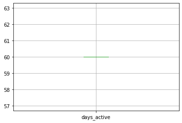
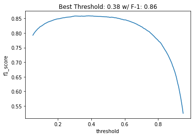
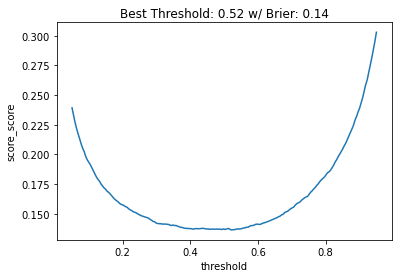
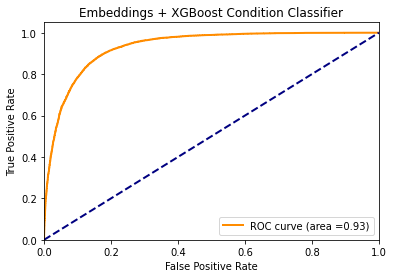

 <div align="center">

</div>

---

predict whether a product on the market is used or new
==============================

In the context of marketplaces, an algorithm is needed to predict if an item listed is new or used.

Your tasks involve the data analysis, designing, processing and modeling of a machine learning solution 
to predict if an item is new or used and then evaluate the model over held-out test data.

To assist in that task a dataset is provided in `MLA_100k_checked_v3.jsonlines`.

For the evaluation, you will use the accuracy metric in order to get a result of 0.86 as minimum. 
Additionally, you will have to choose an appropiate secondary metric and also elaborate an argument on why that metric was chosen.

The deliverables are:
--The file, including all the code needed to define and evaluate a model.
--A document with an explanation on the criteria applied to choose the features, 
  the proposed secondary metric and the performance achieved on that metrics. 
  Optionally, you can deliver an EDA analysis with other formart like .ipynb

Project Organization
------------

    ├── LICENSE
    ├── Makefile           <- Makefilewith commands like `make data` or `make train`
    ├── README.md          <- The top-level README for developers using this project.
    ├── data
    │   ├── interim        <- Intermediate data that has been transformed.
    │   ├── processed      <- The final, canonical data sets.
    │   └── raw            <- The original, immutable data dump.
    │
    ├── models             <- Trained and serialized models, model predictions, or model summaries.
    │
    ├── notebooks          <- Jupyter notebooks with steps for training and evaluating models.
    │
    ├── reports            <- Generated analysis as HTML, PDF, LaTeX, etc.
    │   └── figures        <- Generated graphics and figures to be used in reporting
    │
    └── requirements.txt   <- The requirements file for reproducing the analysis environment, e.g.


<p><small>Project based on the <a target="_blank" href="https://drivendata.github.io/cookiecutter-data-science/">cookiecutter data science project template</a>. #cookiecutterdatascience</small></p>

--------
#### Libraries

* numpy
* pandas
* re
* matplotlib
* seaborn
* embedding_encoder
* sklearn
* xgboost

#### Technologies

* Python version  3.9
* Git

#### Tools

* VS Studio
* Jupyter IPython

#### Services

* Github


# **DEVELOPMENT AND EXPERIMENT: BM25 + BERTOPIC**

# Load Data


```python
import pandas as pd
pd.options.mode.chained_assignment = None  # default='warn'
dfs = pd.read_json('MLA_100k_checked_v3.jsonlines', lines=True)
```


```python
dfs = dfs.rename(columns = {'tags':'tag'})
dfs = dfs.rename(columns = {'id':'Id'})
```

## Get features from dictionary columns


```python
# Get region
dfs['seller_country'] = dfs.apply(lambda x : x['seller_address']['country']['name'], axis = 1)
dfs['seller_state'] = dfs.apply(lambda x : x['seller_address']['state']['name'], axis = 1)
dfs['seller_city'] = dfs.apply(lambda x : x['seller_address']['city']['name'], axis = 1)
```


```python
# Transform id (named as descriptions) column to get data
import ast
def str_to_dict(column):
    for i in range(len(column)):
        try:
            column[i] = ast.literal_eval(column[i][0])
        except:
            return

str_to_dict(dfs['descriptions'])
```


```python
# get data from descriptions and shipping 
dfs = pd.concat([dfs, dfs["descriptions"].apply(pd.Series)], axis=1)
dfs = pd.concat([dfs, dfs["shipping"].apply(pd.Series)], axis=1)
```


```python
pd.set_option('display.max_columns', None)
dfs.head(5)
```


<div>
<style scoped>
    .dataframe tbody tr th:only-of-type {
        vertical-align: middle;
    }

    .dataframe tbody tr th {
        vertical-align: top;
    }

    .dataframe thead th {
        text-align: right;
    }
</style>
<table border="1" class="dataframe">
  <thead>
    <tr style="text-align: right;">
      <th></th>
      <th>seller_address</th>
      <th>warranty</th>
      <th>sub_status</th>
      <th>condition</th>
      <th>deal_ids</th>
      <th>base_price</th>
      <th>shipping</th>
      <th>non_mercado_pago_payment_methods</th>
      <th>seller_id</th>
      <th>variations</th>
      <th>site_id</th>
      <th>listing_type_id</th>
      <th>price</th>
      <th>attributes</th>
      <th>buying_mode</th>
      <th>tag</th>
      <th>listing_source</th>
      <th>parent_item_id</th>
      <th>coverage_areas</th>
      <th>category_id</th>
      <th>descriptions</th>
      <th>last_updated</th>
      <th>international_delivery_mode</th>
      <th>pictures</th>
      <th>Id</th>
      <th>official_store_id</th>
      <th>differential_pricing</th>
      <th>accepts_mercadopago</th>
      <th>original_price</th>
      <th>currency_id</th>
      <th>thumbnail</th>
      <th>title</th>
      <th>automatic_relist</th>
      <th>date_created</th>
      <th>secure_thumbnail</th>
      <th>stop_time</th>
      <th>status</th>
      <th>video_id</th>
      <th>catalog_product_id</th>
      <th>subtitle</th>
      <th>initial_quantity</th>
      <th>start_time</th>
      <th>permalink</th>
      <th>sold_quantity</th>
      <th>available_quantity</th>
      <th>seller_country</th>
      <th>seller_state</th>
      <th>seller_city</th>
      <th>0</th>
      <th>id</th>
      <th>local_pick_up</th>
      <th>methods</th>
      <th>tags</th>
      <th>free_shipping</th>
      <th>mode</th>
      <th>dimensions</th>
      <th>free_methods</th>
    </tr>
  </thead>
  <tbody>
    <tr>
      <th>0</th>
      <td>{'country': {'name': 'Argentina', 'id': 'AR'},...</td>
      <td>None</td>
      <td>[]</td>
      <td>new</td>
      <td>[]</td>
      <td>80.0</td>
      <td>{'local_pick_up': True, 'methods': [], 'tags':...</td>
      <td>[{'description': 'Transferencia bancaria', 'id...</td>
      <td>8208882349</td>
      <td>[]</td>
      <td>MLA</td>
      <td>bronze</td>
      <td>80.0</td>
      <td>[]</td>
      <td>buy_it_now</td>
      <td>[dragged_bids_and_visits]</td>
      <td></td>
      <td>MLA6553902747</td>
      <td>[]</td>
      <td>MLA126406</td>
      <td>{'id': 'MLA4695330653-912855983'}</td>
      <td>2015-09-05T20:42:58.000Z</td>
      <td>none</td>
      <td>[{'size': '500x375', 'secure_url': 'https://a2...</td>
      <td>MLA4695330653</td>
      <td>NaN</td>
      <td>NaN</td>
      <td>True</td>
      <td>NaN</td>
      <td>ARS</td>
      <td>http://mla-s1-p.mlstatic.com/5386-MLA469533065...</td>
      <td>Auriculares Samsung Originales Manos Libres Ca...</td>
      <td>False</td>
      <td>2015-09-05T20:42:53.000Z</td>
      <td>https://a248.e.akamai.net/mla-s1-p.mlstatic.co...</td>
      <td>2015-11-04 20:42:53</td>
      <td>active</td>
      <td>None</td>
      <td>NaN</td>
      <td>NaN</td>
      <td>1</td>
      <td>2015-09-05 20:42:53</td>
      <td>http://articulo.mercadolibre.com.ar/MLA4695330...</td>
      <td>0</td>
      <td>1</td>
      <td>Argentina</td>
      <td>Capital Federal</td>
      <td>San Cristóbal</td>
      <td>NaN</td>
      <td>MLA4695330653-912855983</td>
      <td>True</td>
      <td>[]</td>
      <td>[]</td>
      <td>False</td>
      <td>not_specified</td>
      <td>None</td>
      <td>NaN</td>
    </tr>
    <tr>
      <th>1</th>
      <td>{'country': {'name': 'Argentina', 'id': 'AR'},...</td>
      <td>NUESTRA REPUTACION</td>
      <td>[]</td>
      <td>used</td>
      <td>[]</td>
      <td>2650.0</td>
      <td>{'local_pick_up': True, 'methods': [], 'tags':...</td>
      <td>[{'description': 'Transferencia bancaria', 'id...</td>
      <td>8141699488</td>
      <td>[]</td>
      <td>MLA</td>
      <td>silver</td>
      <td>2650.0</td>
      <td>[]</td>
      <td>buy_it_now</td>
      <td>[]</td>
      <td></td>
      <td>MLA7727150374</td>
      <td>[]</td>
      <td>MLA10267</td>
      <td>{'id': 'MLA7160447179-930764806'}</td>
      <td>2015-09-26T18:08:34.000Z</td>
      <td>none</td>
      <td>[{'size': '499x334', 'secure_url': 'https://a2...</td>
      <td>MLA7160447179</td>
      <td>NaN</td>
      <td>NaN</td>
      <td>True</td>
      <td>NaN</td>
      <td>ARS</td>
      <td>http://mla-s1-p.mlstatic.com/23223-MLA71604471...</td>
      <td>Cuchillo Daga Acero Carbón Casco Yelmo Solinge...</td>
      <td>False</td>
      <td>2015-09-26T18:08:30.000Z</td>
      <td>https://a248.e.akamai.net/mla-s1-p.mlstatic.co...</td>
      <td>2015-11-25 18:08:30</td>
      <td>active</td>
      <td>None</td>
      <td>NaN</td>
      <td>NaN</td>
      <td>1</td>
      <td>2015-09-26 18:08:30</td>
      <td>http://articulo.mercadolibre.com.ar/MLA7160447...</td>
      <td>0</td>
      <td>1</td>
      <td>Argentina</td>
      <td>Capital Federal</td>
      <td>Buenos Aires</td>
      <td>NaN</td>
      <td>MLA7160447179-930764806</td>
      <td>True</td>
      <td>[]</td>
      <td>[]</td>
      <td>False</td>
      <td>me2</td>
      <td>None</td>
      <td>NaN</td>
    </tr>
    <tr>
      <th>2</th>
      <td>{'country': {'name': 'Argentina', 'id': 'AR'},...</td>
      <td>None</td>
      <td>[]</td>
      <td>used</td>
      <td>[]</td>
      <td>60.0</td>
      <td>{'local_pick_up': True, 'methods': [], 'tags':...</td>
      <td>[{'description': 'Transferencia bancaria', 'id...</td>
      <td>8386096505</td>
      <td>[]</td>
      <td>MLA</td>
      <td>bronze</td>
      <td>60.0</td>
      <td>[]</td>
      <td>buy_it_now</td>
      <td>[dragged_bids_and_visits]</td>
      <td></td>
      <td>MLA6561247998</td>
      <td>[]</td>
      <td>MLA1227</td>
      <td>{'id': 'MLA7367189936-916478256'}</td>
      <td>2015-09-09T23:57:10.000Z</td>
      <td>none</td>
      <td>[{'size': '375x500', 'secure_url': 'https://a2...</td>
      <td>MLA7367189936</td>
      <td>NaN</td>
      <td>NaN</td>
      <td>True</td>
      <td>NaN</td>
      <td>ARS</td>
      <td>http://mla-s1-p.mlstatic.com/22076-MLA73671899...</td>
      <td>Antigua Revista Billiken, N° 1826, Año 1954</td>
      <td>False</td>
      <td>2015-09-09T23:57:07.000Z</td>
      <td>https://a248.e.akamai.net/mla-s1-p.mlstatic.co...</td>
      <td>2015-11-08 23:57:07</td>
      <td>active</td>
      <td>None</td>
      <td>NaN</td>
      <td>NaN</td>
      <td>1</td>
      <td>2015-09-09 23:57:07</td>
      <td>http://articulo.mercadolibre.com.ar/MLA7367189...</td>
      <td>0</td>
      <td>1</td>
      <td>Argentina</td>
      <td>Capital Federal</td>
      <td>Boedo</td>
      <td>NaN</td>
      <td>MLA7367189936-916478256</td>
      <td>True</td>
      <td>[]</td>
      <td>[]</td>
      <td>False</td>
      <td>me2</td>
      <td>None</td>
      <td>NaN</td>
    </tr>
    <tr>
      <th>3</th>
      <td>{'country': {'name': 'Argentina', 'id': 'AR'},...</td>
      <td>None</td>
      <td>[]</td>
      <td>new</td>
      <td>[]</td>
      <td>580.0</td>
      <td>{'local_pick_up': True, 'methods': [], 'tags':...</td>
      <td>[{'description': 'Transferencia bancaria', 'id...</td>
      <td>5377752182</td>
      <td>[]</td>
      <td>MLA</td>
      <td>silver</td>
      <td>580.0</td>
      <td>[]</td>
      <td>buy_it_now</td>
      <td>[]</td>
      <td></td>
      <td>None</td>
      <td>[]</td>
      <td>MLA86345</td>
      <td>{'id': 'MLA9191625553-932309698'}</td>
      <td>2015-10-05T16:03:50.306Z</td>
      <td>none</td>
      <td>[{'size': '441x423', 'secure_url': 'https://a2...</td>
      <td>MLA9191625553</td>
      <td>NaN</td>
      <td>NaN</td>
      <td>True</td>
      <td>NaN</td>
      <td>ARS</td>
      <td>http://mla-s2-p.mlstatic.com/183901-MLA9191625...</td>
      <td>Alarma Guardtex Gx412 Seguridad Para El Automo...</td>
      <td>False</td>
      <td>2015-09-28T18:47:56.000Z</td>
      <td>https://a248.e.akamai.net/mla-s2-p.mlstatic.co...</td>
      <td>2015-12-04 01:13:16</td>
      <td>active</td>
      <td>None</td>
      <td>NaN</td>
      <td>NaN</td>
      <td>1</td>
      <td>2015-09-28 18:47:56</td>
      <td>http://articulo.mercadolibre.com.ar/MLA9191625...</td>
      <td>0</td>
      <td>1</td>
      <td>Argentina</td>
      <td>Capital Federal</td>
      <td>Floresta</td>
      <td>NaN</td>
      <td>MLA9191625553-932309698</td>
      <td>True</td>
      <td>[]</td>
      <td>[]</td>
      <td>False</td>
      <td>me2</td>
      <td>None</td>
      <td>NaN</td>
    </tr>
    <tr>
      <th>4</th>
      <td>{'country': {'name': 'Argentina', 'id': 'AR'},...</td>
      <td>MI REPUTACION.</td>
      <td>[]</td>
      <td>used</td>
      <td>[]</td>
      <td>30.0</td>
      <td>{'local_pick_up': True, 'methods': [], 'tags':...</td>
      <td>[{'description': 'Transferencia bancaria', 'id...</td>
      <td>2938071313</td>
      <td>[]</td>
      <td>MLA</td>
      <td>bronze</td>
      <td>30.0</td>
      <td>[]</td>
      <td>buy_it_now</td>
      <td>[dragged_bids_and_visits]</td>
      <td></td>
      <td>MLA3133256685</td>
      <td>[]</td>
      <td>MLA41287</td>
      <td>{'id': 'MLA7787961817-902981678'}</td>
      <td>2015-08-28T13:37:41.000Z</td>
      <td>none</td>
      <td>[{'size': '375x500', 'secure_url': 'https://a2...</td>
      <td>MLA7787961817</td>
      <td>NaN</td>
      <td>NaN</td>
      <td>True</td>
      <td>NaN</td>
      <td>ARS</td>
      <td>http://mla-s2-p.mlstatic.com/13595-MLA77879618...</td>
      <td>Serenata - Jennifer Blake</td>
      <td>False</td>
      <td>2015-08-24T22:07:20.000Z</td>
      <td>https://a248.e.akamai.net/mla-s2-p.mlstatic.co...</td>
      <td>2015-10-23 22:07:20</td>
      <td>active</td>
      <td>None</td>
      <td>NaN</td>
      <td>NaN</td>
      <td>1</td>
      <td>2015-08-24 22:07:20</td>
      <td>http://articulo.mercadolibre.com.ar/MLA7787961...</td>
      <td>0</td>
      <td>1</td>
      <td>Argentina</td>
      <td>Buenos Aires</td>
      <td>Tres de febrero</td>
      <td>NaN</td>
      <td>MLA7787961817-902981678</td>
      <td>True</td>
      <td>[]</td>
      <td>[]</td>
      <td>False</td>
      <td>not_specified</td>
      <td>None</td>
      <td>NaN</td>
    </tr>
  </tbody>
</table>
</div>


```python
# Get payment methods from dict
def convertCol(x,key,i):
    try:
        return x[i][key]
    except: 
        return ''
    
for key in ['description']: #['description','id','type'] -- only description is interesting
    for i in range(0,13):
        dfs[f'payment_{key}{i}'] = dfs['non_mercado_pago_payment_methods'].apply(lambda x: convertCol(x,key,i))
```


```python
# Create a boolean column for each payment method 
lista_c = []
for i in range(0,13):
    lista = dfs[f'payment_description{i}'].unique()
    lista_c.extend(lista)

desc_uniques = set(lista_c)
desc_uniques.remove('')
desc_uniques
```


    {'Acordar con el comprador',
     'American Express',
     'Cheque certificado',
     'Contra reembolso',
     'Diners',
     'Efectivo',
     'Giro postal',
     'MasterCard',
     'Mastercard Maestro',
     'MercadoPago',
     'Tarjeta de crédito',
     'Transferencia bancaria',
     'Visa',
     'Visa Electron'}


```python
# Rename column for an improved dataframe (#TODO: Use apply for performance)
for col in desc_uniques:
    col_name=col.replace(' ','_')
    dfs[col_name] = dfs.isin([col]).any(axis=1)

# drop older columns
dfs = dfs.drop(dfs.loc[:, 'payment_description0':'payment_description12'], axis = 1)
```


```python
import numpy as np
dfs = dfs.applymap(lambda x: x if x else np.nan)
dfs = dfs.dropna(how='all', axis=1)
```

# Data Transformation

## Change type and filter columns

COLUNAS QUE FICAM:
- warranty fica
- sub_status fica, quando suspende anúncio, pode ter a ver
- base_price fica
- seller_id fica
- price fica
- buying_mode fica
- parent_item_id fica
- last_updated fica
- id fica
- official_store_id fica
- accepts_mercadopago fica (duplicado com mercado pago?)
- original_price fica
- currency_id fica
- title fica
- automatic_relist fica
- stop_time fica
- status fica
- video_id fica (pode ser vídeo de usados)
- initial_quantity definitivamente fica
- start_time fica
- sold_quantity fica
- available_quantity fica
- seller_country, state, city fica
- local_pick_up fica
- free_shipping fica (provavelmente usados usam menos, venda privada)
- Contra_reembolso fica (usados precisam de reembolso)
- Giro_postal fica
- mode fica (não sei o que é, mas tá completa, not_specified pode ser mais comum em usados)
- tags fica
- date_created

FICA MAS TRANFORMAR (pagamentos):
- Cheque_certificado
- Mastercard_Maestro
- Diners
- Transferencia_bancaria
- MercadoPago (será? duplicado com accepts mercadopago?)
- Efectivo
- Tarjeta_de_crédito (duplicado com outras colunas? mesclar colunas e preencher essa)
- American_Express
- MasterCard
- Visa_Electron
- Visa
- Acordar_con_el_comprador

COLUNAS QUE SAIEM:
- seller_address sai
- deals_ids sai, não parece dizer nada relevante para nós
- shipping sai
- non_mercad_pago_etc (transformei) sai
- site_id sai
- listin_type_id sai
- category sai
- description sai (virou id)
- international_delivery_mode
- pictures sai
- thumbnail sai
- secure_thumbnail sai
- permalink sai
- free_methods sai, não parece ter info relevante


DÚVIDAS:
- variations não sei, mas acho que sai, são anuncios relacionados
- attributes não sei, mas acho que sai
- dimensions acho que sai


```python
# Rename columns
dfs = dfs.rename(columns = {'id':'descr_id', 'Id': 'id'})

# Reorder columns
dfs = dfs[['title', 'condition', 'warranty','initial_quantity', 'available_quantity', 'sold_quantity',
                'sub_status', 'buying_mode', 'original_price', 'base_price', 'price', 'currency_id',
                'seller_country', 'seller_state', 'seller_city', 'Giro_postal',  
                'free_shipping', 'local_pick_up', 'mode', 'tags', 'tag',
                'Contra_reembolso','Acordar_con_el_comprador', 'Cheque_certificado', 'Efectivo', 'Transferencia_bancaria', 'Tarjeta_de_crédito',
                'Mastercard_Maestro', 'MasterCard', 'Visa_Electron', 'Visa', 'Diners', 'American_Express',
                'status', 'automatic_relist',
                'accepts_mercadopago', 'MercadoPago', 
                'id', 'descr_id', 'deal_ids', 'parent_item_id', 'category_id', 'seller_id', 'official_store_id', 'video_id',
                'date_created', 'start_time', 'last_updated', 'stop_time']]
```


```python
dfs['accepts_mercadopago'].value_counts()
```


    True    97781
    Name: accepts_mercadopago, dtype: int64


```python
dfs['MercadoPago'].value_counts()
```


    True    720
    Name: MercadoPago, dtype: int64


```python
# Merge columns about same subjects
dfs['accepts_mercadopago'] = dfs['accepts_mercadopago'].fillna(dfs['MercadoPago'])
```


```python
dfs['MasterCard'].value_counts()
```


    True    647
    Name: MasterCard, dtype: int64


```python
dfs['MasterCard'] = dfs['Mastercard_Maestro'].fillna(dfs['MercadoPago'])
```


```python
dfs['Visa'] = dfs['Visa_Electron'].fillna(dfs['Visa'])
```


```python
dfs['Tarjeta_de_crédito'].value_counts()
```


    True    24638
    Name: Tarjeta_de_crédito, dtype: int64


```python
dfs['Tarjeta_de_crédito'] = dfs['Tarjeta_de_crédito'].fillna(dfs['Visa'])
dfs['Tarjeta_de_crédito'] = dfs['Tarjeta_de_crédito'].fillna(dfs['MasterCard'])
dfs['Tarjeta_de_crédito'] = dfs['Tarjeta_de_crédito'].fillna(dfs['Diners'])
dfs['Tarjeta_de_crédito'] = dfs['Tarjeta_de_crédito'].fillna(dfs['American_Express'])
dfs['Tarjeta_de_crédito'] = dfs['Tarjeta_de_crédito'].fillna(dfs['Visa'])
```


```python
dfs['Tarjeta_de_crédito'].value_counts()
```


    True    25928
    Name: Tarjeta_de_crédito, dtype: int64


```python
dfs = dfs.rename(columns = {'Tarjeta_de_crédito':'Aceptan_Tarjeta'})
```


```python
# Drop used columns
dfs = dfs.drop(columns=['MercadoPago', 'Mastercard_Maestro', 'Visa_Electron'])
dfs = dfs.drop(columns=['Visa', 'MasterCard', 'Diners', 'American_Express'])
```


```python
# Treat columns to access data
def try_join(l):
    try:
        return ','.join(map(str, l))
    except TypeError:
        return np.nan

dfs['sub_status'] = try_join(dfs['sub_status'])
dfs['tags'] = try_join(dfs['tags'])
```


```python
dfs.columns
```


    Index(['title', 'condition', 'warranty', 'initial_quantity',
           'available_quantity', 'sold_quantity', 'sub_status', 'buying_mode',
           'original_price', 'base_price', 'price', 'currency_id',
           'seller_country', 'seller_state', 'seller_city', 'Giro_postal',
           'free_shipping', 'local_pick_up', 'mode', 'tags', 'tag',
           'Contra_reembolso', 'Acordar_con_el_comprador', 'Cheque_certificado',
           'Efectivo', 'Transferencia_bancaria', 'Aceptan_Tarjeta', 'status',
           'automatic_relist', 'accepts_mercadopago', 'id', 'descr_id', 'deal_ids',
           'parent_item_id', 'category_id', 'seller_id', 'official_store_id',
           'video_id', 'date_created', 'start_time', 'last_updated', 'stop_time'],
          dtype='object')


```python
dfs.info()
```

    <class 'pandas.core.frame.DataFrame'>
    RangeIndex: 100000 entries, 0 to 99999
    Data columns (total 42 columns):
     #   Column                    Non-Null Count   Dtype         
    ---  ------                    --------------   -----         
     0   title                     100000 non-null  object        
     1   condition                 100000 non-null  object        
     2   warranty                  39103 non-null   object        
     3   initial_quantity          100000 non-null  int64         
     4   available_quantity        100000 non-null  int64         
     5   sold_quantity             16920 non-null   float64       
     6   sub_status                100000 non-null  object        
     7   buying_mode               100000 non-null  object        
     8   original_price            143 non-null     float64       
     9   base_price                100000 non-null  float64       
     10  price                     100000 non-null  float64       
     11  currency_id               100000 non-null  object        
     12  seller_country            99997 non-null   object        
     13  seller_state              99997 non-null   object        
     14  seller_city               99996 non-null   object        
     15  Giro_postal               1665 non-null    object        
     16  free_shipping             3016 non-null    object        
     17  local_pick_up             79561 non-null   object        
     18  mode                      100000 non-null  object        
     19  tags                      100000 non-null  object        
     20  tag                       75090 non-null   object        
     21  Contra_reembolso          648 non-null     object        
     22  Acordar_con_el_comprador  7991 non-null    object        
     23  Cheque_certificado        460 non-null     object        
     24  Efectivo                  67059 non-null   object        
     25  Transferencia_bancaria    51469 non-null   object        
     26  Aceptan_Tarjeta           25928 non-null   object        
     27  status                    100000 non-null  object        
     28  automatic_relist          4697 non-null    object        
     29  accepts_mercadopago       97781 non-null   object        
     30  id                        100000 non-null  object        
     31  descr_id                  41 non-null      object        
     32  deal_ids                  240 non-null     object        
     33  parent_item_id            76989 non-null   object        
     34  category_id               100000 non-null  object        
     35  seller_id                 100000 non-null  int64         
     36  official_store_id         818 non-null     float64       
     37  video_id                  2985 non-null    object        
     38  date_created              100000 non-null  object        
     39  start_time                100000 non-null  datetime64[ns]
     40  last_updated              100000 non-null  object        
     41  stop_time                 100000 non-null  datetime64[ns]
    dtypes: datetime64[ns](2), float64(5), int64(3), object(32)
    memory usage: 32.0+ MB


```python
# Transform some columns to boolean type
dfs[['Giro_postal', 'free_shipping', 'local_pick_up', 'Contra_reembolso', 
     'Acordar_con_el_comprador', 'Cheque_certificado', 'Efectivo', 
     'Transferencia_bancaria', 'Aceptan_Tarjeta', 'automatic_relist']] = dfs[['Giro_postal', 'free_shipping', 'local_pick_up', 'Contra_reembolso', 
                                                          'Acordar_con_el_comprador', 'Cheque_certificado', 'Efectivo', 
                                                          'Transferencia_bancaria', 'Aceptan_Tarjeta', 'automatic_relist']].notna()
```


```python
# Transform type of all columns
dfs = dfs.astype({'title':'str',
                  'condition': 'category', #bool
                  'warranty': 'category',
                  'initial_quantity': 'float', #int
                  'available_quantity': 'float', #int
                  'sold_quantity': 'float', #int
                  'sub_status': 'category', #bool?
                  'buying_mode': 'category',
                  'original_price': 'float',
                  'base_price': 'float',
                  'price': 'float',
                  'currency_id': 'category',
                  'seller_country': 'category',
                  'seller_state': 'category',
                  'seller_city': 'category',
                  'Giro_postal': 'bool',
                  'free_shipping': 'bool',
                  'local_pick_up': 'bool',
                  'mode': 'category',
                  'tags': 'category', #bool?
                  #'tag': 'category',
                  'Contra_reembolso': 'bool',
                  'Acordar_con_el_comprador': 'bool',
                  'Cheque_certificado': 'bool',
                  'Efectivo': 'bool',
                  'Transferencia_bancaria': 'bool',
                  'Aceptan_Tarjeta': 'bool',
                  'id': 'category',
                  'descr_id': 'category',
                  #'deal_ids': 'category',
                  'parent_item_id': 'category',
                  'category_id': 'category',
                  'seller_id': 'category',
                  'official_store_id': 'category',
                  'video_id': 'category',
                  #'date_created': 'datetime',
                  # 'start_time': 'datetime',
                  # 'last_updated': 'datetime',
                  # 'stop_time': 'datetime',
                  'status': 'category', #bool?
                  'automatic_relist': 'bool'
                                         })
```


```python
dfs.columns
```


    Index(['title', 'condition', 'warranty', 'initial_quantity',
           'available_quantity', 'sold_quantity', 'sub_status', 'buying_mode',
           'original_price', 'base_price', 'price', 'currency_id',
           'seller_country', 'seller_state', 'seller_city', 'Giro_postal',
           'free_shipping', 'local_pick_up', 'mode', 'tags', 'tag',
           'Contra_reembolso', 'Acordar_con_el_comprador', 'Cheque_certificado',
           'Efectivo', 'Transferencia_bancaria', 'Aceptan_Tarjeta', 'status',
           'automatic_relist', 'accepts_mercadopago', 'id', 'descr_id', 'deal_ids',
           'parent_item_id', 'category_id', 'seller_id', 'official_store_id',
           'video_id', 'date_created', 'start_time', 'last_updated', 'stop_time'],
          dtype='object')


```python
# Check missing values

def missing_zero_values_table(df):
        zero_val = (df == 0.00).astype(int).sum(axis=0)
        mis_val = df.isnull().sum()
        mis_val_percent = 100 * df.isnull().sum() / len(df)
        mz_table = pd.concat([zero_val, mis_val, mis_val_percent], axis=1)
        mz_table = mz_table.rename(
        columns = {0 : 'Zero Values', 1 : 'Missing Values', 2 : '% of Total Values'})
        mz_table['Total Zero Missing Values'] = mz_table['Zero Values'] + mz_table['Missing Values']
        mz_table['% Total Zero Missing Values'] = 100 * mz_table['Total Zero Missing Values'] / len(df)
        mz_table['Data Type'] = df.dtypes
        mz_table = mz_table[
            mz_table.iloc[:,1] != 0].sort_values(
        '% of Total Values', ascending=False).round(1)
        print ("Your selected dataframe has " + str(df.shape[1]) + " columns and " + str(df.shape[0]) + " Rows.\n"      
            "There are " + str(mz_table.shape[0]) +
              " columns that have missing values.")
#         mz_table.to_excel('D:/sampledata/missing_and_zero_values.xlsx', freeze_panes=(1,0), index = False)
        return mz_table

missing_zero_values_table(dfs)
```

    Your selected dataframe has 42 columns and 100000 Rows.
    There are 13 columns that have missing values.


<div>
<style scoped>
    .dataframe tbody tr th:only-of-type {
        vertical-align: middle;
    }

    .dataframe tbody tr th {
        vertical-align: top;
    }

    .dataframe thead th {
        text-align: right;
    }
</style>
<table border="1" class="dataframe">
  <thead>
    <tr style="text-align: right;">
      <th></th>
      <th>Zero Values</th>
      <th>Missing Values</th>
      <th>% of Total Values</th>
      <th>Total Zero Missing Values</th>
      <th>% Total Zero Missing Values</th>
      <th>Data Type</th>
    </tr>
  </thead>
  <tbody>
    <tr>
      <th>descr_id</th>
      <td>0</td>
      <td>99959</td>
      <td>100.0</td>
      <td>99959</td>
      <td>100.0</td>
      <td>category</td>
    </tr>
    <tr>
      <th>original_price</th>
      <td>0</td>
      <td>99857</td>
      <td>99.9</td>
      <td>99857</td>
      <td>99.9</td>
      <td>float64</td>
    </tr>
    <tr>
      <th>deal_ids</th>
      <td>0</td>
      <td>99760</td>
      <td>99.8</td>
      <td>99760</td>
      <td>99.8</td>
      <td>object</td>
    </tr>
    <tr>
      <th>official_store_id</th>
      <td>0</td>
      <td>99182</td>
      <td>99.2</td>
      <td>99182</td>
      <td>99.2</td>
      <td>category</td>
    </tr>
    <tr>
      <th>video_id</th>
      <td>0</td>
      <td>97015</td>
      <td>97.0</td>
      <td>97015</td>
      <td>97.0</td>
      <td>category</td>
    </tr>
    <tr>
      <th>sold_quantity</th>
      <td>0</td>
      <td>83080</td>
      <td>83.1</td>
      <td>83080</td>
      <td>83.1</td>
      <td>float64</td>
    </tr>
    <tr>
      <th>warranty</th>
      <td>0</td>
      <td>60897</td>
      <td>60.9</td>
      <td>60897</td>
      <td>60.9</td>
      <td>category</td>
    </tr>
    <tr>
      <th>tag</th>
      <td>0</td>
      <td>24910</td>
      <td>24.9</td>
      <td>24910</td>
      <td>24.9</td>
      <td>object</td>
    </tr>
    <tr>
      <th>parent_item_id</th>
      <td>0</td>
      <td>23011</td>
      <td>23.0</td>
      <td>23011</td>
      <td>23.0</td>
      <td>category</td>
    </tr>
    <tr>
      <th>accepts_mercadopago</th>
      <td>0</td>
      <td>2219</td>
      <td>2.2</td>
      <td>2219</td>
      <td>2.2</td>
      <td>object</td>
    </tr>
    <tr>
      <th>seller_city</th>
      <td>0</td>
      <td>4</td>
      <td>0.0</td>
      <td>4</td>
      <td>0.0</td>
      <td>category</td>
    </tr>
    <tr>
      <th>seller_country</th>
      <td>0</td>
      <td>3</td>
      <td>0.0</td>
      <td>3</td>
      <td>0.0</td>
      <td>category</td>
    </tr>
    <tr>
      <th>seller_state</th>
      <td>0</td>
      <td>3</td>
      <td>0.0</td>
      <td>3</td>
      <td>0.0</td>
      <td>category</td>
    </tr>
  </tbody>
</table>
</div>


```python
display(dfs['seller_country'].value_counts())
dfs = dfs.drop(columns = 'seller_country') # We can drop Country column, it's always Argentina
display(dfs['seller_city'].mode()[0])
display(dfs['seller_state'].mode()[0])
dfs['seller_city'] = dfs['seller_city'].fillna(dfs['seller_city'].mode()[0])
dfs['seller_state'] = dfs['seller_state'].fillna(dfs['seller_state'].mode()[0])
```


    Argentina    99997
    Name: seller_country, dtype: int64


    'CABA'


    'Capital Federal'


```python
dfs['accepts_mercadopago'] = dfs['accepts_mercadopago'].fillna(False)
dfs['sold_quantity'] = dfs['sold_quantity'].fillna(0) # Is it ok to fill sold_quantity with 0? [VALIDATE]
```


```python
dfs['warranty'] = dfs['warranty'].replace(r'^\s*$', np.nan, regex=True)
dfs['warranty'].isna().sum()
```


    60897


```python
import pandas as pd
df_temp1 = dfs[dfs['warranty'].isnull()]
df_temp1['warranty'] = False

df_temp2 = dfs[~dfs['warranty'].isnull()]
df_temp2['warranty'] = True

frames = [df_temp1, df_temp2]
dfs = pd.concat(frames)
dfs = dfs.astype({'warranty':'bool'})
```


```python
dfs['warranty'].value_counts()
```


    False    60897
    True     39103
    Name: warranty, dtype: int64


```python
display('number of sold_quantity', dfs.sold_quantity.nunique())
```


    'number of sold_quantity'


    317


```python
def get_value_per_cat():
    flag = dfs.select_dtypes(include=['category']).shape[1]
    i = 0

    while i <= flag:
        print(dict(dfs.select_dtypes(include=['category']).iloc[:,i:i+1].nunique()))
        i = i+1

get_value_per_cat()
```

    {'condition': 2}
    {'sub_status': 1}
    {'buying_mode': 3}
    {'currency_id': 2}
    {'seller_state': 24}
    {'seller_city': 3655}
    {'mode': 4}
    {'tags': 1}
    {'status': 4}
    {'id': 100000}
    {'descr_id': 41}
    {'parent_item_id': 76989}
    {'category_id': 10907}
    {'seller_id': 35915}
    {'official_store_id': 198}
    {'video_id': 2077}
    {}


```python
dfs.columns
```


    Index(['title', 'condition', 'warranty', 'initial_quantity',
           'available_quantity', 'sold_quantity', 'sub_status', 'buying_mode',
           'original_price', 'base_price', 'price', 'currency_id', 'seller_state',
           'seller_city', 'Giro_postal', 'free_shipping', 'local_pick_up', 'mode',
           'tags', 'tag', 'Contra_reembolso', 'Acordar_con_el_comprador',
           'Cheque_certificado', 'Efectivo', 'Transferencia_bancaria',
           'Aceptan_Tarjeta', 'status', 'automatic_relist', 'accepts_mercadopago',
           'id', 'descr_id', 'deal_ids', 'parent_item_id', 'category_id',
           'seller_id', 'official_store_id', 'video_id', 'date_created',
           'start_time', 'last_updated', 'stop_time'],
          dtype='object')


```python
import re
dfs['sub_status'] = dfs['sub_status'].str.replace('nan,','')
dfs['sub_status'] = dfs['sub_status'].str.replace(',nan','')
display(len(re.findall(r'suspended',dfs['sub_status'][1])))
display(dfs['sub_status'].value_counts().value_counts())
display(dfs.shape)

# We concluded this column is useless: every row has the same count of the same value ('suspended')
dfs = dfs.drop('sub_status', axis=1)
```


    966


    100000    1
    Name: sub_status, dtype: int64


    (100000, 41)


```python
# dfs['tags'] = dfs['tags'].str.replace('nan,','')
# dfs['tags'] = dfs['tags'].str.replace(',nan','')

# from ast import literal_eval
# dfs['tags'] = dfs['tags'].apply(lambda x: literal_eval(str(x)))

# def deduplicate(column):
#     flag = len(column)
#     i = 0
    
#     while i <= flag:
#         try:
#             # 1. Convert into list of tuples
#             tpls = [tuple(x) for x in column[i]]
#             # 2. Create dictionary with empty values and
#             # 3. convert back to a list (dups removed)
#             dct = list(dict.fromkeys(tpls))
#             # 4. Convert list of tuples to list of lists
#             dup_free = [list(x) for x in lst]
#             # Print everything
#             column[i] = list(map(''.join, dup_free))
#             # [[1, 1], [0, 1], [0, 1], [1, 1]]
#             i = i+1
#         except:
#             return
        
# deduplicate(dfs['tags'])
# display(dfs['tags'].value_counts().value_counts())
# display(dfs.shape)
# display(dfs['tag'].value_counts().value_counts())

# Other useless colums -- all rows have the same values
dfs = dfs.drop('tags', axis=1)
dfs = dfs.drop('tag', axis=1)        
```


```python
display('dataframe shape', dfs.shape)
display('unique ids', dfs.id.nunique())
display('number of sellers', dfs.seller_id.nunique())
display('number of categories', dfs.category_id.nunique())

#Drop useless column
dfs = dfs.drop(['id'], axis=1)
```


    'dataframe shape'


    (100000, 38)


    'unique ids'


    100000


    'number of sellers'


    35915


    'number of categories'


    10907


```python
missing_zero_values_table(dfs)
```

    Your selected dataframe has 37 columns and 100000 Rows.
    There are 6 columns that have missing values.


<div>
<style scoped>
    .dataframe tbody tr th:only-of-type {
        vertical-align: middle;
    }

    .dataframe tbody tr th {
        vertical-align: top;
    }

    .dataframe thead th {
        text-align: right;
    }
</style>
<table border="1" class="dataframe">
  <thead>
    <tr style="text-align: right;">
      <th></th>
      <th>Zero Values</th>
      <th>Missing Values</th>
      <th>% of Total Values</th>
      <th>Total Zero Missing Values</th>
      <th>% Total Zero Missing Values</th>
      <th>Data Type</th>
    </tr>
  </thead>
  <tbody>
    <tr>
      <th>descr_id</th>
      <td>0</td>
      <td>99959</td>
      <td>100.0</td>
      <td>99959</td>
      <td>100.0</td>
      <td>category</td>
    </tr>
    <tr>
      <th>original_price</th>
      <td>0</td>
      <td>99857</td>
      <td>99.9</td>
      <td>99857</td>
      <td>99.9</td>
      <td>float64</td>
    </tr>
    <tr>
      <th>deal_ids</th>
      <td>0</td>
      <td>99760</td>
      <td>99.8</td>
      <td>99760</td>
      <td>99.8</td>
      <td>object</td>
    </tr>
    <tr>
      <th>official_store_id</th>
      <td>0</td>
      <td>99182</td>
      <td>99.2</td>
      <td>99182</td>
      <td>99.2</td>
      <td>category</td>
    </tr>
    <tr>
      <th>video_id</th>
      <td>0</td>
      <td>97015</td>
      <td>97.0</td>
      <td>97015</td>
      <td>97.0</td>
      <td>category</td>
    </tr>
    <tr>
      <th>parent_item_id</th>
      <td>0</td>
      <td>23011</td>
      <td>23.0</td>
      <td>23011</td>
      <td>23.0</td>
      <td>category</td>
    </tr>
  </tbody>
</table>
</div>


```python
dfs = dfs.dropna(axis=1) #drop all columns with missing values (we checked and they are not necessary)
```


```python
# Deal with datetimes to create new features
dfs['year_start'] = pd.to_datetime(dfs['start_time']).dt.year.astype('category')
dfs['month_start'] = pd.to_datetime(dfs['start_time']).dt.month.astype('category')
dfs['year_stop'] = pd.to_datetime(dfs['stop_time']).dt.year.astype('category')
dfs['month_stop'] = pd.to_datetime(dfs['stop_time']).dt.month.astype('category')
dfs['week_day'] = pd.to_datetime(dfs['stop_time']).dt.weekday.astype('category')
#dfs['days_active'] = (dfs['start_time'] - dfs['stop_time']).dt.days
dfs['days_active'] = [int(i.days) for i in (dfs.stop_time - dfs.start_time)]
dfs['days_active'] = dfs['days_active'].astype('int')
dfs = dfs.reset_index(drop=True)

#dfs = dfs.drop(['date_created', 'start_time', 'last_updated', 'stop_time'], axis=1)
boxplot = dfs.boxplot(column=['days_active'], showfliers=False)
```


    

    


# Model: Embeddings Encoding + XGBoost


```python
import pandas as pd
import numpy as np
from sklearn.compose import ColumnTransformer
from sklearn.preprocessing import OneHotEncoder, StandardScaler, OrdinalEncoder
from sklearn.pipeline import make_pipeline
from sklearn.model_selection import train_test_split
from sklearn.impute import SimpleImputer
from sklearn.ensemble import RandomForestRegressor
from sklearn.metrics import mean_squared_error, mean_absolute_percentage_error
from sklearn.linear_model import LogisticRegression
from sklearn.inspection import permutation_importance
from sklearn.preprocessing import label_binarize
from sklearn.model_selection import train_test_split
from sklearn.pipeline import make_pipeline
from sklearn.preprocessing import StandardScaler

from embedding_encoder import EmbeddingEncoder
from embedding_encoder.utils.compose import ColumnTransformerWithNames
```


```python
#dfs = pd.read_parquet('cleaned_data_haha.parquet.gzip')
```


```python
dfs.columns
```


    Index(['title', 'condition', 'warranty', 'initial_quantity',
           'available_quantity', 'sold_quantity', 'buying_mode', 'base_price',
           'price', 'currency_id', 'seller_state', 'seller_city', 'Giro_postal',
           'free_shipping', 'local_pick_up', 'mode', 'Contra_reembolso',
           'Acordar_con_el_comprador', 'Cheque_certificado', 'Efectivo',
           'Transferencia_bancaria', 'Aceptan_Tarjeta', 'status',
           'automatic_relist', 'accepts_mercadopago', 'category_id', 'seller_id',
           'date_created', 'start_time', 'last_updated', 'stop_time', 'year_start',
           'month_start', 'year_stop', 'month_stop', 'week_day', 'days_active'],
          dtype='object')


```python
dfs.select_dtypes(include=['int16', 'int32', 'int64', 'float16', 'float32', 'float64']).columns
```


    Index(['initial_quantity', 'available_quantity', 'sold_quantity', 'base_price',
           'price', 'days_active'],
          dtype='object')


```python
dfs.select_dtypes(include=['category']).columns
```


    Index(['condition', 'buying_mode', 'currency_id', 'seller_state',
           'seller_city', 'mode', 'status', 'category_id', 'seller_id',
           'year_start', 'month_start', 'year_stop', 'month_stop', 'week_day'],
          dtype='object')


```python
# Split train and test
numerics = ['int16', 'int32', 'int64', 'float16', 'float32', 'float64', 'category', 'bool']

X = dfs.select_dtypes(include=numerics).drop(columns=['condition'], axis=1)

dfs['condition'] = dfs['condition'].replace('new', 0)
dfs['condition'] = dfs['condition'].replace('used', 1)
y = dfs.condition

X_train, X_test, y_train, y_test = train_test_split(X, y, test_size=0.2)
```


```python
from sklearn.ensemble import RandomForestClassifier, GradientBoostingClassifier
import xgboost as xgb

categorical_high = ["seller_city", "category_id"] # "seller_id"
numeric = X.select_dtypes(include=['int16', 'int32', 'int64', 'float16', 'float32', 'float64']).columns#.drop(columns=['condition'], axis=1)
categorical_low = ["buying_mode", "currency_id", "seller_state", "mode", "status", "week_day", "month_stop", "year_stop", "month_start", "year_start"] + list(X.select_dtypes(include=['bool']).columns)
#categorical_low = ["buying_mode", "currency_id", "seller_state", "mode", "status", "week_day", "month_stop", "month_start"] + list(X.select_dtypes(include=['bool']).columns)
#categorical_low = ["buying_mode", "currency_id", "seller_state", "mode", "status"] + list(X.select_dtypes(include=['bool']).columns)

def build_pipeline(mode: str):
    if mode == "embeddings":
        high_cardinality_encoder = EmbeddingEncoder(task="classification") #regression
    else:
        high_cardinality_encoder = OrdinalEncoder()
    one_hot_encoder = OneHotEncoder(handle_unknown="ignore")
    scaler = StandardScaler()
    imputer = ColumnTransformerWithNames([("numeric", SimpleImputer(strategy="mean"), numeric), ("categorical", SimpleImputer(strategy="most_frequent"), categorical_low+categorical_high)])
    processor = ColumnTransformer([("one_hot", one_hot_encoder, categorical_low), (mode, high_cardinality_encoder, categorical_high), ("scale", scaler, numeric)])

    return make_pipeline(imputer, processor, xgb.XGBClassifier(n_estimators= 200,
                                                                 max_depth= 30,                         # Lower ratios avoid over-fitting. Default is 6.
                                                                 objective = 'binary:logistic',         # Default is reg:squarederror. 'multi:softprob' for multiclass and get proba.  
                                                                 #num_class = 2,                        # Use if softprob is set.
                                                                 reg_lambda = 10,                       # Larger ratios avoid over-fitting. Default is 1.
                                                                 gamma = 0.3,                           # Larger values avoid over-fitting. Default is 0. # Values from 0.3 to 0.8 if you have many columns (especially if you did one-hot encoding), or 0.8 to 1 if you only have a few columns.
                                                                 alpha = 1,                             # Larger ratios avoid over-fitting. Default is 0.
                                                                 learning_rate= 0.10,                   # Lower ratios avoid over-fitting. Default is 3.
                                                                 colsample_bytree= 0.7,                 # Lower ratios avoid over-fitting.
                                                                 scale_pos_weight = 1,                  # Default is 1. Control balance of positive and negative weights, for unbalanced classes.
                                                                 subsample = 0.1,                       # Lower ratios avoid over-fitting. Default 1. 0.5 recommended. # 0.1 if using GPU.
                                                                 min_child_weight = 3,                  # Larger ratios avoid over-fitting. Default is 1.
                                                                 missing = np.nan,                      # Deal with missing values
                                                                 num_parallel_tree = 2,                 # Parallel trees constructed during each iteration. Default is 1.
                                                                 importance_type = 'weight',
                                                                 eval_metric = 'auc',
                                                                 #use_label_encoder = True,
                                                                 #enable_categorical = True,
                                                                 verbosity = 1,
                                                                 nthread = -1,                          # Set -1 to use all threads.
                                                                 #use_rmm = True,                       # Use GPU if available
                                                                 tree_method = 'auto', # auto           # 'gpu_hist'. Default is auto: analyze the data and chooses the fastest.
                                                                 #gradient_based = True,
                                                                )) #RandomForestClassifier() #LogisticRegression())
                
```


```python
%%time
embeddings_pipeline = build_pipeline("embeddings")
embeddings_pipeline.fit(X_train, y_train)
embedding_preds = embeddings_pipeline.predict_proba(X_test) 
```

    2022-07-19 15:35:20.872263: W tensorflow/stream_executor/platform/default/dso_loader.cc:64] Could not load dynamic library 'libcudart.so.11.0'; dlerror: libcudart.so.11.0: cannot open shared object file: No such file or directory
    2022-07-19 15:35:20.872321: I tensorflow/stream_executor/cuda/cudart_stub.cc:29] Ignore above cudart dlerror if you do not have a GPU set up on your machine.
    2022-07-19 15:35:23.074450: W tensorflow/stream_executor/platform/default/dso_loader.cc:64] Could not load dynamic library 'libcuda.so.1'; dlerror: libcuda.so.1: cannot open shared object file: No such file or directory
    2022-07-19 15:35:23.074487: W tensorflow/stream_executor/cuda/cuda_driver.cc:269] failed call to cuInit: UNKNOWN ERROR (303)
    2022-07-19 15:35:23.074515: I tensorflow/stream_executor/cuda/cuda_diagnostics.cc:156] kernel driver does not appear to be running on this host (brspobitanl1727): /proc/driver/nvidia/version does not exist
    2022-07-19 15:35:23.074705: I tensorflow/core/platform/cpu_feature_guard.cc:151] This TensorFlow binary is optimized with oneAPI Deep Neural Network Library (oneDNN) to use the following CPU instructions in performance-critical operations:  AVX2 FMA
    To enable them in other operations, rebuild TensorFlow with the appropriate compiler flags.
    /home/ggnicolau/miniconda3/envs/jupyter-1/lib/python3.10/site-packages/xgboost/sklearn.py:1224: UserWarning: The use of label encoder in XGBClassifier is deprecated and will be removed in a future release. To remove this warning, do the following: 1) Pass option use_label_encoder=False when constructing XGBClassifier object; and 2) Encode your labels (y) as integers starting with 0, i.e. 0, 1, 2, ..., [num_class - 1].
      warnings.warn(label_encoder_deprecation_msg, UserWarning)


    CPU times: user 15min 3s, sys: 8.37 s, total: 15min 11s
    Wall time: 2min 16s


```python
embedding_preds = embeddings_pipeline.predict_proba(X_test) 
```


```python
%%time
import matplotlib.pyplot as plt
import seaborn as sns
from sklearn.metrics import cohen_kappa_score, brier_score_loss 
from sklearn.metrics import matthews_corrcoef, mean_squared_error, log_loss
from sklearn.metrics import f1_score, recall_score, precision_score
from sklearn.metrics import roc_auc_score, roc_curve, auc

# Plot F1-Score and Threshold
from sklearn.metrics import f1_score

threshold_list = np.linspace(0.05, 0.95, 200)

f1_list = []
for threshold in threshold_list:
    pred_label = np.where(embedding_preds[:,1] < threshold, 0, 1)
    f1 = f1_score(y_test, pred_label)
    f1_list.append(f1)

df_f1 = pd.DataFrame({'threshold':threshold_list, 'f1_score': f1_list})
df_f1[df_f1['f1_score'] == max(df_f1['f1_score'])]
bt = df_f1[df_f1['f1_score'] == max(df_f1['f1_score'])]['threshold'].values[0]
f1 = df_f1[df_f1['f1_score'] == max(df_f1['f1_score'])]['f1_score'].values[0]
title = "Best Threshold: " + str(round(bt, 2)) + " w/ F-1: " + str(round(f1, 2))
sns.lineplot(data=df_f1, x='threshold', y='f1_score').set_title(title)
plt.show()

# Plot your Score and threshold
threshold_list = np.linspace(0.05, 0.95, 200)

score_list = []
for threshold in threshold_list:
    pred_label = np.where(embedding_preds[:,1] > threshold, 0, 1)
    score = brier_score_loss(y_test, pred_label)
    score_list.append(score)

df_score = pd.DataFrame({'threshold':threshold_list, 'score_score': score_list})
df_score[df_score['score_score'] == max(df_score['score_score'])]
bt = df_score[df_score['score_score'] == max(df_score['score_score'])]['threshold'].values[0]
score = df_score[df_score['score_score'] == max(df_score['score_score'])]['score_score'].values[0]
title = "Best Threshold: " + str(round(bt, 2)) + " w/ Brier: " + str(round(score, 2))
sns.lineplot(data=df_score, x='threshold', y='score_score').set_title(title)
plt.show()

from sklearn.metrics import roc_curve

#Plot ROC_Curve
fpr, tpr, thresholds = roc_curve(y_test, embedding_preds[:,1])
roc = roc_auc_score(y_test, embedding_preds[:,1])
plt.figure()
lw = 2
plt.plot(
    fpr,
    tpr,
    color="darkorange",
    lw=lw,
    label=f"ROC curve (area ={'%.2f' % roc})"# % roc_auc["micro"],
)

plt.plot([0, 1], [0, 1], color="navy", lw=lw, linestyle="--")
plt.xlim([0.0, 1.0])
plt.ylim([0.0, 1.05])
plt.xlabel("False Positive Rate")
plt.ylabel("True Positive Rate")
plt.title("Embeddings + XGBoost Condition Classifier")
plt.legend(loc="lower right")
plt.savefig('embe_xgboost_roc_curve.png', bbox_inches='tight', dpi = 300)
plt.show()
```


    

    


    

    


    

    


    CPU times: user 2.06 s, sys: 613 ms, total: 2.67 s
    Wall time: 1.83 s


```python
# best_preds_score = np.where(embedding_preds < bt, 0, 1) # Uncomment if you want to change threshold... Lower, because threshold calculated on Brier Loss and lower is better

print("mean_squared_error_test = {}".format(mean_squared_error(y_test, embedding_preds[:,1], squared=False)))
print("Roc_auc = {}".format(roc_auc_score(y_test, embedding_preds[:,1])))
print("Brier_error = {}".format(brier_score_loss(y_test, embedding_preds[:,1])))
print("Logloss_test = {}".format(log_loss(y_test, embedding_preds[:,1])))
# print("Precision = {}".format(precision_score(Y_test, preds_test[:,1])))
# print("Recall = {}".format(recall_score(Y_test, preds_test[:,1])))
# print("F1 = {}".format(f1_score(Y_test, preds_test[:,1])))
# print("Kappa_score = {}".format(cohen_kappa_score(Y_test, preds_test[:,1])))
# print("Matthews_corrcoef = {}".format(matthews_corrcoef(Y_test, preds_test[:,1])))
```

    mean_squared_error_test = 0.32138884980187493
    Roc_auc = 0.9316140416223828
    Brier_error = 0.10329079277697213
    Logloss_test = 0.33533914064784914


# **BIBLIOGRAPHIC REFERENCES**

Beiske, K. (2013) &quot;Similarity in elasticsearch,&quot; _Elastic Blog_. Elastic, 26 November. Available at: [https://www.elastic.co/en/blog/found-similarity-in-elasticsearch](https://www.elastic.co/pt/blog/found-similarity-in-elasticsearch) (Accessed: July 3, 2022).

Grivolla, J., Jourlin, P. and De Mori, R. (no date) _Automatic classification of queries by expected retrieval performance_, _Grivolla.net_. Available at: [http://www.grivolla.net/articles/sigir2005-qp.pdf](http://www.grivolla.net/articles/sigir2005-qp.pdf) (Accessed: July 3, 2022).

Grootendorst, MP. (2022) _The algorithm_, _Github.io_. Available at: [https://maartengr.github.io/BERTopic/algorithm/algorithm.html](https://maartengr.github.io/BERTopic/algorithm/algorithm.html) (Accessed: July 3, 2022).

Jimenez, S. _et_ al. &#39;BM25-CTF: Improving TF and IDF Factors in BM25 by Using Collection Term Frequencies&#39;. 1 Jan. 2018 : 2887 – 2899. Available at:[https://www.researchgate.net/profile/Sergio-Jimenez-7/publication/325231406\_BM25-CTF\_Improving\_TF\_and\_IDF\_factors\_in\_BM25\_by\_using\_collection\_term\_frequencies/links/5b0d8349aca2725783f140e5/BM25-CTF-Improving-TF-and-in-using-factor-by-IDF-25 collection-term-frequencies.pdf](https://www.researchgate.net/profile/Sergio-Jimenez-7/publication/325231406_BM25-CTF_Improving_TF_and_IDF_factors_in_BM25_by_using_collection_term_frequencies/links/5b0d8349aca2725783f140e5/BM25-CTF-Improving-TF-and-IDF-factors-in-BM25-by-using-collection-term-frequencies.pdf) (Accessed: July 3, 2022).

Kamal, A. (2021) _Building your favorite TV series search engine - Information Retrieval Using BM25 Ranking_, _Medium_. Available at: [https://abishek21.medium.com/building-your-favourite-tv-series-search-engine-information-retrieval-using-bm25-ranking-8e8c54bcdb38](https://abishek21.medium.com/building-your-favourite-tv-series-search-engine-information-retrieval-using-bm25-ranking-8e8c54bcdb38) (Accessed: July 3, 2022).

Manning, Christopher D., et al. (2008) _Introduction to information retrieval_. Cambridge University Press. Available at: [https://nlp.stanford.edu/IR-book/pdf/irbookonlinereading.pdf](https://nlp.stanford.edu/IR-book/pdf/irbookonlinereading.pdf) (Accessed: July 3, 2022).

Moura, MF (2009). &#39;Contributions to the construction of topic taxonomies in restricted domains using statistical learning&#39;. Doctoral thesis. Institute of Mathematics and Computer Sciences of the University of São Paulo (ICMC-USP), São Carlos. Available at:[https://teses.usp.br/teses/disponiveis/55/55134/tde-05042010-162834/publico/MFM\_Tese\_5318963.pdf](https://teses.usp.br/teses/disponiveis/55/55134/tde-05042010-162834/publico/MFM_Tese_5318963.pdf)(Accessed: July 3, 2022).

Nogueira, R. _et al._ (2019) &quot;Document expansion by query prediction,&quot; _arXiv [cs.IR]_. Available at: [http://arxiv.org/abs/1904.08375](http://arxiv.org/abs/1904.08375) (Accessed: July 3, 2022).

_Open directory project.org: ODP web directory built with the DMOZ RDF database_ (no date) _Odp.org_. Available at: [http://www.odp.org/homepage.php](http://www.odp.org/homepage.php) (Accessed: July 3, 2022).

Seitz, R. (no date) _Understanding TF-IDF and BM-25_, _KMW Technology_. Available at: [https://kmwllc.com/index.php/2020/03/20/understanding-tf-idf-and-bm-25/](https://kmwllc.com/index.php/2020/03/20/understanding-tf-idf-and-bm-25/) (Accessed: July 3, 2022).

Yates, A., Nogueira, R., &amp; Lin, J. (2021). Pretrained transformers for text ranking: BERT and beyond. _Proceedings of the 44th International ACM SIGIR Conference on Research and Development in Information Retrieval_. Available at: [https://arxiv.org/pdf/2010.06467v1.pdf](https://arxiv.org/pdf/2010.06467v1.pdf) (Accessed: July 3, 2022).

## Version

0.0.5.0

## Author

* **Guilherme Giuliano Nicolau**: @ggnicolau (<https://github.com/ggnicolau>)
* **Ricardo Marcondes Marcacini**: @rmarcacini (<https://github.com/rmarcacini>)

---
<div align="center">


<div class=''text-justify''>


---

</div>
