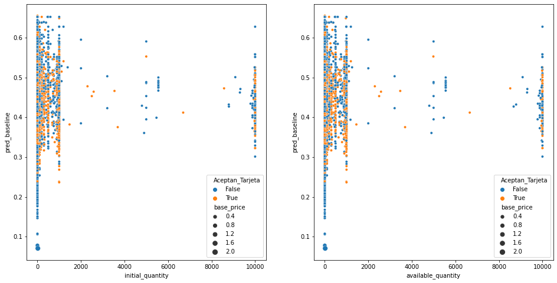
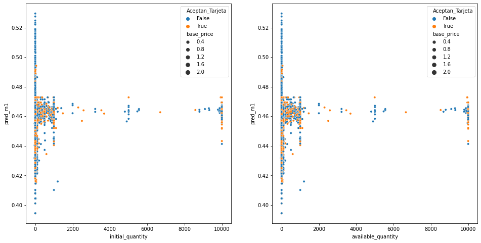
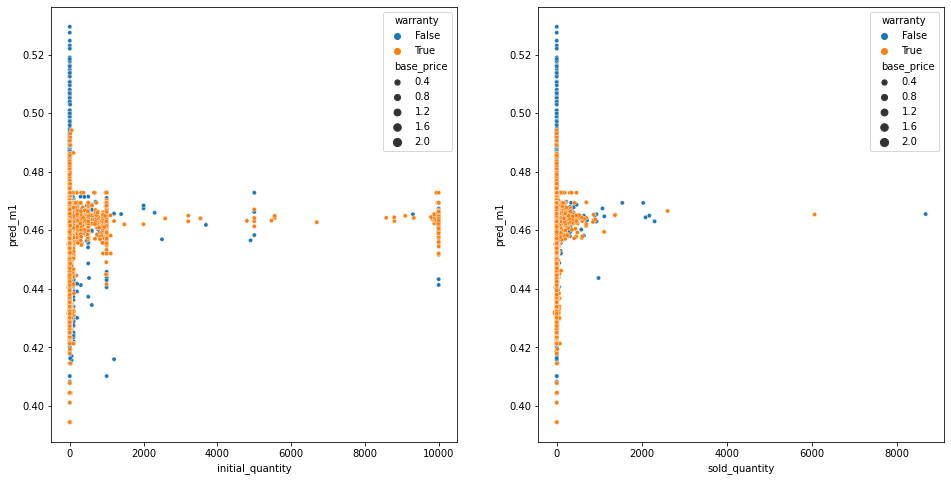
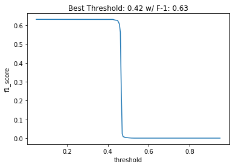
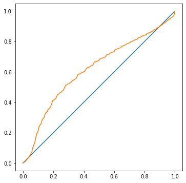
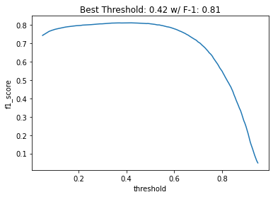
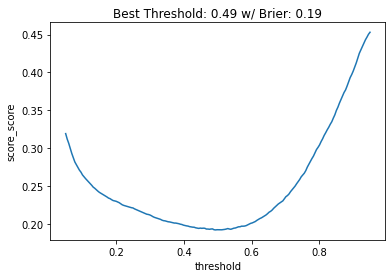
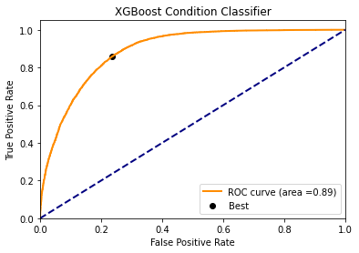
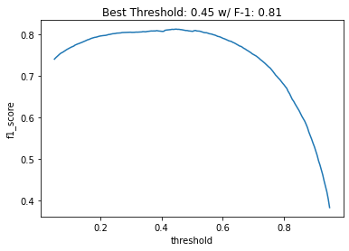
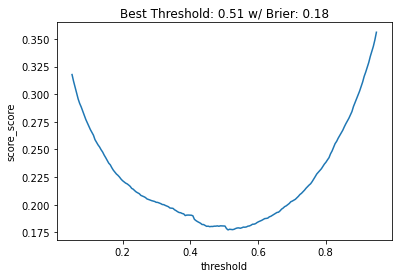

 <div align="center">

</div>

---

Project Organization
------------

    ├── LICENSE
    ├── README.md          <- The top-level README for developers using this project.
    ├── data
    │   ├── interim        <- Intermediate data that has been transformed.
    │   ├── processed      <- The final, canonical data sets.
    │   └── raw            <- The original, immutable data dump.
    │
    ├── models             <- Trained and serialized models, model predictions, or model summaries.
    │
    ├── notebooks          <- Jupyter notebooks with steps for training and evaluating models.
    │
    ├── reports            <- Generated analysis as HTML, PDF, LaTeX, etc.
    │   └── figures        <- Generated graphics and figures to be used in reporting
    │
    └── requirements.txt   <- The requirements file for reproducing the analysis environment, e.g.


<p><small>Project based on the <a target="_blank" href="https://drivendata.github.io/cookiecutter-data-science/">cookiecutter data science project template</a>. #cookiecutterdatascience</small></p>

--------

PREDICT WETHER IS NEW OR USED
==============================

In the context of marketplaces, an algorithm is needed to predict if an item listed is new or used.

Your tasks involve the data analysis, designing, processing and modeling of a machine learning solution
to predict if an item is new or used and then evaluate the model over held-out test data.

To assist in that task a dataset is provided in `MLA_100k_checked_v3.jsonlines`.

For the evaluation, you will use the accuracy metric in order to get a result of 0.86 as minimum.
Additionally, you will have to choose an appropiate secondary metric and also elaborate an argument on why that metric was chosen.

The deliverables are:

- The file, including all the code needed to define and evaluate a model.
- A document with an explanation on the criteria applied to choose the features,
  the proposed secondary metric and the performance achieved on that metrics.
- Optionally, you can deliver an EDA analysis with other formart like .ipynb

## Resumed Conclusions

1) You will find our first **selected columns at section 2.1**, then you can check our selected columns after treatment and feature engineering.
2) We didn't predict our classes (0 and 1), but we decided to predict the **probability** for our binary classification problem, since it's more meaningful (literally, we calculate the probability to be class 0 or 1). Thus, we didn't calculate accuracy, precision, recall, F1-score, Kappa or other metrics. For probability evaluation, we opted to use **mean squared error, log loss and Brier score** (lower is better). We also used the **ROC curve** to evaluate the model and calculated **ROC AUC** score (higher is better).
3) Our metrics only make sense if we compare between models. We compared four models.
   (a) Our **first** one is our **baseline**, we used **logistic regressions** with no parameters and got a bad result with a score of **0.69**. We mostly used it because applying a linear model can help to get insights from the data;
   (b) Our **second** one is more complex one with less interpretability, we used an ensemble of non-linear hierarchical tree models, called **XGBoost**. We got a **ROC AUC of 0.89**, which is better than our baseline model and it's a good result, with high computational cost though;
   (c) Our **third** one, we first used **embeddings** (neural networks) to encode our categorical features (category and seller city) with **high cardinality** which we couldn't do One Hot Encoding (due to computational cost) or Label Encoding (since unique values are independent from each other). After that, we just applied a **Logistic Regression**. Impressively, we got a **ROC AUC of 0.9** with a simple linear model for binary classification;
   (d) Finally, our **fourth** one we also used **embeddings** for encoding, but then used an **XGBoost**. We got a **ROC AUC of 0.93**, as we expected to get a better result from the previous one;

- ***REMARKS: Personally, I think the embeddings encoding with Logistic Regression is the best model, because it's simpler and has more interpretability. Occam's Razor principle states that other things equal, explanations that posit fewer entities, or fewer kinds of entities, are to be preferred to explanations that posit more.***

<div>
<table border="1" class="dataframe">
  <thead>
    <tr style="text-align: right;">
      <th></th>
      <th>Metrics</th>
      <th>XGBoost</th>
      <th>Emb_Logistic</th>
      <th>Emb_XGBoost</th>
    </tr>
  </thead>
  <tbody>
    <tr>
      <th>0</th>
      <td>mean_squared_error_test</td>
      <td>0.36</td>
      <td>0.36</td>
      <td>0.32</td>
    </tr>
    <tr>
      <th>1</th>
      <td>Roc_auc</td>
      <td>0.89</td>
      <td>0.90</td>
      <td>0.93</td>
    </tr>
    <tr>
      <th>2</th>
      <td>Brier_error</td>
      <td>0.13</td>
      <td>0.12</td>
      <td>0.10</td>
    </tr>
    <tr>
      <th>3</th>
      <td>Logloss</td>
      <td>0.40</td>
      <td>0.39</td>
      <td>0.34</td>
    </tr>
  </tbody>
</table>
</div>

```
- The Mean Squared Error (or MSE) is much like the mean absolute error in that it provides a gross idea of the magnitude of error. 
Taking the square root of the mean squared error converts the units back to the original units of the output variable and can be meaningful for description and presentation. 
This is called the Root Mean Squared Error (or RMSE).

- Logistic loss (or log loss) is a performance metric for evaluating the predictions of probabilities of membership to a given class. 
The scalar probability between 0 and 1 can be seen as a measure of confidence for a prediction by an algorithm. Predictions that are correct or incorrect are rewarded or punished proportionally to the confidence of the prediction.
It heavily penalizes predicted probabilities far away from their expected value.

- The Brier score calculates the mean squared error between predicted probabilities and the expected values. 
It`s gentler than log loss but still penalizes proportional to the distance from the expected value.

- Area Under ROC Curve (or ROC AUC for short) is a performance metric for binary classification problems. 
The AUC represents a model’s ability to discriminate between positive and negative classes. 
An area of 1.0 represents a model that made all predictions perfectly. An area of 0.5 represents a model as good as random. 
A ROC Curve is a plot of the true positive rate and the false positive rate for a given set of probability predictions at different thresholds used to map the probabilities to class labels. 
The area under the curve is then the approximate integral under the ROC Curve.
The area under ROC curve that summarizes the likelihood of the model predicting a higher probability for true positive cases than true negative cases.

*(machinelearningmastery.com)*
```

--------


#### Libraries

* numpy
* pandas
* re
* matplotlib
* seaborn
* embedding_encoder
* sklearn
* xgboost

#### Technologies

* Python version  3.9
* Git

#### Tools

* VS Studio
* Jupyter IPython

#### Services

* Github

--------

# **PREDICT WETHER MARKETPLACE PRODUCTS ARE NEW OR USED**

# 1.Load Data


```python
import pandas as pd
pd.options.mode.chained_assignment = None  # default='warn'
dfs = pd.read_json('MLA_100k_checked_v3.jsonlines', lines=True)
```


```python
dfs = dfs.rename(columns = {'tags':'tag'})
dfs = dfs.rename(columns = {'id':'Id'})
```

## 1.1.Get features from dictionary columns


```python
# Get region
dfs['seller_country'] = dfs.apply(lambda x : x['seller_address']['country']['name'], axis = 1)
dfs['seller_state'] = dfs.apply(lambda x : x['seller_address']['state']['name'], axis = 1)
dfs['seller_city'] = dfs.apply(lambda x : x['seller_address']['city']['name'], axis = 1)
```


```python
# Transform id (named as descriptions) column to get data
import ast
def str_to_dict(column):
    for i in range(len(column)):
        try:
            column[i] = ast.literal_eval(column[i][0])
        except:
            return

str_to_dict(dfs['descriptions'])
```


```python
# get data from descriptions and shipping 
dfs = pd.concat([dfs, dfs["descriptions"].apply(pd.Series)], axis=1)
dfs = pd.concat([dfs, dfs["shipping"].apply(pd.Series)], axis=1)
```


```python
pd.set_option('display.max_columns', None)
dfs.head(5)
```


<div>
<table border="1" class="dataframe">
  <thead>
    <tr style="text-align: right;">
      <th></th>
      <th>seller_address</th>
      <th>warranty</th>
      <th>sub_status</th>
      <th>condition</th>
      <th>deal_ids</th>
      <th>base_price</th>
      <th>shipping</th>
      <th>non_mercado_pago_payment_methods</th>
      <th>seller_id</th>
      <th>variations</th>
      <th>site_id</th>
      <th>listing_type_id</th>
      <th>price</th>
      <th>attributes</th>
      <th>buying_mode</th>
      <th>tag</th>
      <th>listing_source</th>
      <th>parent_item_id</th>
      <th>coverage_areas</th>
      <th>category_id</th>
      <th>descriptions</th>
      <th>last_updated</th>
      <th>international_delivery_mode</th>
      <th>pictures</th>
      <th>Id</th>
      <th>official_store_id</th>
      <th>differential_pricing</th>
      <th>accepts_mercadopago</th>
      <th>original_price</th>
      <th>currency_id</th>
      <th>thumbnail</th>
      <th>title</th>
      <th>automatic_relist</th>
      <th>date_created</th>
      <th>secure_thumbnail</th>
      <th>stop_time</th>
      <th>status</th>
      <th>video_id</th>
      <th>catalog_product_id</th>
      <th>subtitle</th>
      <th>initial_quantity</th>
      <th>start_time</th>
      <th>permalink</th>
      <th>sold_quantity</th>
      <th>available_quantity</th>
      <th>seller_country</th>
      <th>seller_state</th>
      <th>seller_city</th>
      <th>0</th>
      <th>id</th>
      <th>local_pick_up</th>
      <th>methods</th>
      <th>tags</th>
      <th>free_shipping</th>
      <th>mode</th>
      <th>dimensions</th>
      <th>free_methods</th>
    </tr>
  </thead>
  <tbody>
    <tr>
      <th>0</th>
      <td>{'country': {'name': 'Argentina', 'id': 'AR'},...</td>
      <td>None</td>
      <td>[]</td>
      <td>new</td>
      <td>[]</td>
      <td>80.0</td>
      <td>{'local_pick_up': True, 'methods': [], 'tags':...</td>
      <td>[{'description': 'Transferencia bancaria', 'id...</td>
      <td>8208882349</td>
      <td>[]</td>
      <td>MLA</td>
      <td>bronze</td>
      <td>80.0</td>
      <td>[]</td>
      <td>buy_it_now</td>
      <td>[dragged_bids_and_visits]</td>
      <td></td>
      <td>MLA6553902747</td>
      <td>[]</td>
      <td>MLA126406</td>
      <td>{'id': 'MLA4695330653-912855983'}</td>
      <td>2015-09-05T20:42:58.000Z</td>
      <td>none</td>
      <td>[{'size': '500x375', 'secure_url': 'https://a2...</td>
      <td>MLA4695330653</td>
      <td>NaN</td>
      <td>NaN</td>
      <td>True</td>
      <td>NaN</td>
      <td>ARS</td>
      <td>http://mla-s1-p.mlstatic.com/5386-MLA469533065...</td>
      <td>Auriculares Samsung Originales Manos Libres Ca...</td>
      <td>False</td>
      <td>2015-09-05T20:42:53.000Z</td>
      <td>https://a248.e.akamai.net/mla-s1-p.mlstatic.co...</td>
      <td>2015-11-04 20:42:53</td>
      <td>active</td>
      <td>None</td>
      <td>NaN</td>
      <td>NaN</td>
      <td>1</td>
      <td>2015-09-05 20:42:53</td>
      <td>http://articulo.mercadolibre.com.ar/MLA4695330...</td>
      <td>0</td>
      <td>1</td>
      <td>Argentina</td>
      <td>Capital Federal</td>
      <td>San Cristóbal</td>
      <td>NaN</td>
      <td>MLA4695330653-912855983</td>
      <td>True</td>
      <td>[]</td>
      <td>[]</td>
      <td>False</td>
      <td>not_specified</td>
      <td>None</td>
      <td>NaN</td>
    </tr>
    <tr>
      <th>1</th>
      <td>{'country': {'name': 'Argentina', 'id': 'AR'},...</td>
      <td>NUESTRA REPUTACION</td>
      <td>[]</td>
      <td>used</td>
      <td>[]</td>
      <td>2650.0</td>
      <td>{'local_pick_up': True, 'methods': [], 'tags':...</td>
      <td>[{'description': 'Transferencia bancaria', 'id...</td>
      <td>8141699488</td>
      <td>[]</td>
      <td>MLA</td>
      <td>silver</td>
      <td>2650.0</td>
      <td>[]</td>
      <td>buy_it_now</td>
      <td>[]</td>
      <td></td>
      <td>MLA7727150374</td>
      <td>[]</td>
      <td>MLA10267</td>
      <td>{'id': 'MLA7160447179-930764806'}</td>
      <td>2015-09-26T18:08:34.000Z</td>
      <td>none</td>
      <td>[{'size': '499x334', 'secure_url': 'https://a2...</td>
      <td>MLA7160447179</td>
      <td>NaN</td>
      <td>NaN</td>
      <td>True</td>
      <td>NaN</td>
      <td>ARS</td>
      <td>http://mla-s1-p.mlstatic.com/23223-MLA71604471...</td>
      <td>Cuchillo Daga Acero Carbón Casco Yelmo Solinge...</td>
      <td>False</td>
      <td>2015-09-26T18:08:30.000Z</td>
      <td>https://a248.e.akamai.net/mla-s1-p.mlstatic.co...</td>
      <td>2015-11-25 18:08:30</td>
      <td>active</td>
      <td>None</td>
      <td>NaN</td>
      <td>NaN</td>
      <td>1</td>
      <td>2015-09-26 18:08:30</td>
      <td>http://articulo.mercadolibre.com.ar/MLA7160447...</td>
      <td>0</td>
      <td>1</td>
      <td>Argentina</td>
      <td>Capital Federal</td>
      <td>Buenos Aires</td>
      <td>NaN</td>
      <td>MLA7160447179-930764806</td>
      <td>True</td>
      <td>[]</td>
      <td>[]</td>
      <td>False</td>
      <td>me2</td>
      <td>None</td>
      <td>NaN</td>
    </tr>
    <tr>
      <th>2</th>
      <td>{'country': {'name': 'Argentina', 'id': 'AR'},...</td>
      <td>None</td>
      <td>[]</td>
      <td>used</td>
      <td>[]</td>
      <td>60.0</td>
      <td>{'local_pick_up': True, 'methods': [], 'tags':...</td>
      <td>[{'description': 'Transferencia bancaria', 'id...</td>
      <td>8386096505</td>
      <td>[]</td>
      <td>MLA</td>
      <td>bronze</td>
      <td>60.0</td>
      <td>[]</td>
      <td>buy_it_now</td>
      <td>[dragged_bids_and_visits]</td>
      <td></td>
      <td>MLA6561247998</td>
      <td>[]</td>
      <td>MLA1227</td>
      <td>{'id': 'MLA7367189936-916478256'}</td>
      <td>2015-09-09T23:57:10.000Z</td>
      <td>none</td>
      <td>[{'size': '375x500', 'secure_url': 'https://a2...</td>
      <td>MLA7367189936</td>
      <td>NaN</td>
      <td>NaN</td>
      <td>True</td>
      <td>NaN</td>
      <td>ARS</td>
      <td>http://mla-s1-p.mlstatic.com/22076-MLA73671899...</td>
      <td>Antigua Revista Billiken, N° 1826, Año 1954</td>
      <td>False</td>
      <td>2015-09-09T23:57:07.000Z</td>
      <td>https://a248.e.akamai.net/mla-s1-p.mlstatic.co...</td>
      <td>2015-11-08 23:57:07</td>
      <td>active</td>
      <td>None</td>
      <td>NaN</td>
      <td>NaN</td>
      <td>1</td>
      <td>2015-09-09 23:57:07</td>
      <td>http://articulo.mercadolibre.com.ar/MLA7367189...</td>
      <td>0</td>
      <td>1</td>
      <td>Argentina</td>
      <td>Capital Federal</td>
      <td>Boedo</td>
      <td>NaN</td>
      <td>MLA7367189936-916478256</td>
      <td>True</td>
      <td>[]</td>
      <td>[]</td>
      <td>False</td>
      <td>me2</td>
      <td>None</td>
      <td>NaN</td>
    </tr>
    <tr>
      <th>3</th>
      <td>{'country': {'name': 'Argentina', 'id': 'AR'},...</td>
      <td>None</td>
      <td>[]</td>
      <td>new</td>
      <td>[]</td>
      <td>580.0</td>
      <td>{'local_pick_up': True, 'methods': [], 'tags':...</td>
      <td>[{'description': 'Transferencia bancaria', 'id...</td>
      <td>5377752182</td>
      <td>[]</td>
      <td>MLA</td>
      <td>silver</td>
      <td>580.0</td>
      <td>[]</td>
      <td>buy_it_now</td>
      <td>[]</td>
      <td></td>
      <td>None</td>
      <td>[]</td>
      <td>MLA86345</td>
      <td>{'id': 'MLA9191625553-932309698'}</td>
      <td>2015-10-05T16:03:50.306Z</td>
      <td>none</td>
      <td>[{'size': '441x423', 'secure_url': 'https://a2...</td>
      <td>MLA9191625553</td>
      <td>NaN</td>
      <td>NaN</td>
      <td>True</td>
      <td>NaN</td>
      <td>ARS</td>
      <td>http://mla-s2-p.mlstatic.com/183901-MLA9191625...</td>
      <td>Alarma Guardtex Gx412 Seguridad Para El Automo...</td>
      <td>False</td>
      <td>2015-09-28T18:47:56.000Z</td>
      <td>https://a248.e.akamai.net/mla-s2-p.mlstatic.co...</td>
      <td>2015-12-04 01:13:16</td>
      <td>active</td>
      <td>None</td>
      <td>NaN</td>
      <td>NaN</td>
      <td>1</td>
      <td>2015-09-28 18:47:56</td>
      <td>http://articulo.mercadolibre.com.ar/MLA9191625...</td>
      <td>0</td>
      <td>1</td>
      <td>Argentina</td>
      <td>Capital Federal</td>
      <td>Floresta</td>
      <td>NaN</td>
      <td>MLA9191625553-932309698</td>
      <td>True</td>
      <td>[]</td>
      <td>[]</td>
      <td>False</td>
      <td>me2</td>
      <td>None</td>
      <td>NaN</td>
    </tr>
    <tr>
      <th>4</th>
      <td>{'country': {'name': 'Argentina', 'id': 'AR'},...</td>
      <td>MI REPUTACION.</td>
      <td>[]</td>
      <td>used</td>
      <td>[]</td>
      <td>30.0</td>
      <td>{'local_pick_up': True, 'methods': [], 'tags':...</td>
      <td>[{'description': 'Transferencia bancaria', 'id...</td>
      <td>2938071313</td>
      <td>[]</td>
      <td>MLA</td>
      <td>bronze</td>
      <td>30.0</td>
      <td>[]</td>
      <td>buy_it_now</td>
      <td>[dragged_bids_and_visits]</td>
      <td></td>
      <td>MLA3133256685</td>
      <td>[]</td>
      <td>MLA41287</td>
      <td>{'id': 'MLA7787961817-902981678'}</td>
      <td>2015-08-28T13:37:41.000Z</td>
      <td>none</td>
      <td>[{'size': '375x500', 'secure_url': 'https://a2...</td>
      <td>MLA7787961817</td>
      <td>NaN</td>
      <td>NaN</td>
      <td>True</td>
      <td>NaN</td>
      <td>ARS</td>
      <td>http://mla-s2-p.mlstatic.com/13595-MLA77879618...</td>
      <td>Serenata - Jennifer Blake</td>
      <td>False</td>
      <td>2015-08-24T22:07:20.000Z</td>
      <td>https://a248.e.akamai.net/mla-s2-p.mlstatic.co...</td>
      <td>2015-10-23 22:07:20</td>
      <td>active</td>
      <td>None</td>
      <td>NaN</td>
      <td>NaN</td>
      <td>1</td>
      <td>2015-08-24 22:07:20</td>
      <td>http://articulo.mercadolibre.com.ar/MLA7787961...</td>
      <td>0</td>
      <td>1</td>
      <td>Argentina</td>
      <td>Buenos Aires</td>
      <td>Tres de febrero</td>
      <td>NaN</td>
      <td>MLA7787961817-902981678</td>
      <td>True</td>
      <td>[]</td>
      <td>[]</td>
      <td>False</td>
      <td>not_specified</td>
      <td>None</td>
      <td>NaN</td>
    </tr>
  </tbody>
</table>
</div>


```python
# Get payment methods from dict
def convertCol(x,key,i):
    try:
        return x[i][key]
    except: 
        return ''
    
for key in ['description']: #['description','id','type'] -- only description is interesting
    for i in range(0,13):
        dfs[f'payment_{key}{i}'] = dfs['non_mercado_pago_payment_methods'].apply(lambda x: convertCol(x,key,i))
```


```python
# Create a boolean column for each payment method 
lista_c = []
for i in range(0,13):
    lista = dfs[f'payment_description{i}'].unique()
    lista_c.extend(lista)

desc_uniques = set(lista_c)
desc_uniques.remove('')
desc_uniques
```


    {'Acordar con el comprador',
     'American Express',
     'Cheque certificado',
     'Contra reembolso',
     'Diners',
     'Efectivo',
     'Giro postal',
     'MasterCard',
     'Mastercard Maestro',
     'MercadoPago',
     'Tarjeta de crédito',
     'Transferencia bancaria',
     'Visa',
     'Visa Electron'}


```python
# Rename column for an improved dataframe (#TODO: Use apply for performance)
for col in desc_uniques:
    col_name=col.replace(' ','_')
    dfs[col_name] = dfs.isin([col]).any(axis=1)

# drop older columns
dfs = dfs.drop(dfs.loc[:, 'payment_description0':'payment_description12'], axis = 1)
```


```python
import numpy as np
dfs = dfs.applymap(lambda x: x if x else np.nan)
dfs = dfs.dropna(how='all', axis=1)
```

# 2.Data Transformation

## 2.1.Change type and filter columns

COLUMNS THAT MATTERS:
- warranty (good and new products have different kind of warranties)
- sub_status (when a product ad is suspended might be due it's condition)
- base_price (price are different when used or new)
- seller_id (different sellers might sell used or new items)
- price (price again)
- buying_mode (type of buying might implicate something)
- parent_item_id (might have correlation between similar products)
- last_updated (we'll check)
- id (we'll check)
- official_store_id (different stores sells different items and conditions)
- accepts_mercadopago (new products might accept more payment methods)
- original_price (price again)
- currency_id (type of payment and currency might be due to the kind of seller and products)
- title (keep title to find product)
- automatic_relist (we'll check')
- stop_time (time might influece)
- status (status might influece)
- video_id fica (we'll check, but might be videos for used products)
- initial_quantity (a good feature, used products have low counts)
- start_time (time again)
- sold_quantity (quantity again)
- available_quantity (quantity again)
- seller_country, state, city (used or new ads might have imbalanced distribution between regions)
- local_pick_up (being new or used might influence if local pickup is available)
- free_shipping (big sellers for new products might be more capable of assuming free shipping)
- Contra_reembolso fica (payment methods matters)
- Giro_postal (stays)
- mode fica (don't know what it is but it's full, 'not_specified' might be more common on used products)
- tags (we'll check about tags)
- tag (we'll check about tag)
- date_created
- category 

TRANSFORM COLUMNS (TYPE OF PAYMENTS):
- Cheque_certificado
- Mastercard_Maestro
- Diners
- Transferencia_bancaria
- MercadoPago (será? duplicado com accepts mercadopago?)
- Efectivo
- Tarjeta_de_crédito (duplicado com outras colunas? mesclar colunas e preencher essa)
- American_Express
- MasterCard
- Visa_Electron
- Visa
- Acordar_con_el_comprador

COLUMNS WE DON'T NEED:
- seller_address (too specific)
- deals_ids (nothing relevant, we checked)
- shipping (nothing relevant, we checked)
- non_mercad_pago_etc (transformed)
- site_id (too specific)
- listin_type_id sai
- description (nothing relevant, we checked, turned out to be id)
- international_delivery_mode
- pictures (nothing relevant, we checked)
- thumbnail (nothing relevant, we checked)
- secure_thumbnail (nothing relevant, we checked)
- permalink (nothing relevant, we checked)
- free_methods (nothing relevant, we checked)

DOUBTS:
- variations
- attributes
- dimensionS


```python
# Rename columns
dfs = dfs.rename(columns = {'id':'descr_id', 'Id': 'id'})

# Reorder columns
dfs = dfs[['title', 'condition', 'warranty','initial_quantity', 'available_quantity', 'sold_quantity',
                'sub_status', 'buying_mode', 'original_price', 'base_price', 'price', 'currency_id',
                'seller_country', 'seller_state', 'seller_city', 'Giro_postal',  
                'free_shipping', 'local_pick_up', 'mode', 'tags', 'tag',
                'Contra_reembolso','Acordar_con_el_comprador', 'Cheque_certificado', 'Efectivo', 'Transferencia_bancaria', 'Tarjeta_de_crédito',
                'Mastercard_Maestro', 'MasterCard', 'Visa_Electron', 'Visa', 'Diners', 'American_Express',
                'status', 'automatic_relist',
                'accepts_mercadopago', 'MercadoPago', 
                'id', 'descr_id', 'deal_ids', 'parent_item_id', 'category_id', 'seller_id', 'official_store_id', 'video_id',
                'date_created', 'start_time', 'last_updated', 'stop_time']]
```


```python
dfs['accepts_mercadopago'].value_counts()
```


    True    97781
    Name: accepts_mercadopago, dtype: int64


```python
dfs['MercadoPago'].value_counts()
```


    True    720
    Name: MercadoPago, dtype: int64


```python
# Merge columns about same subjects
dfs['accepts_mercadopago'] = dfs['accepts_mercadopago'].fillna(dfs['MercadoPago'])
```


```python
dfs['MasterCard'].value_counts()
```


    True    647
    Name: MasterCard, dtype: int64


```python
dfs['MasterCard'] = dfs['Mastercard_Maestro'].fillna(dfs['MercadoPago'])
```


```python
dfs['Visa'] = dfs['Visa_Electron'].fillna(dfs['Visa'])
```


```python
dfs['Tarjeta_de_crédito'].value_counts()
```


    True    24638
    Name: Tarjeta_de_crédito, dtype: int64


```python
dfs['Tarjeta_de_crédito'] = dfs['Tarjeta_de_crédito'].fillna(dfs['Visa'])
dfs['Tarjeta_de_crédito'] = dfs['Tarjeta_de_crédito'].fillna(dfs['MasterCard'])
dfs['Tarjeta_de_crédito'] = dfs['Tarjeta_de_crédito'].fillna(dfs['Diners'])
dfs['Tarjeta_de_crédito'] = dfs['Tarjeta_de_crédito'].fillna(dfs['American_Express'])
dfs['Tarjeta_de_crédito'] = dfs['Tarjeta_de_crédito'].fillna(dfs['Visa'])
```


```python
dfs['Tarjeta_de_crédito'].value_counts()
```


    True    25928
    Name: Tarjeta_de_crédito, dtype: int64


```python
dfs = dfs.rename(columns = {'Tarjeta_de_crédito':'Aceptan_Tarjeta'})
```


```python
# Drop used columns
dfs = dfs.drop(columns=['MercadoPago', 'Mastercard_Maestro', 'Visa_Electron'])
dfs = dfs.drop(columns=['Visa', 'MasterCard', 'Diners', 'American_Express'])
```


```python
# Treat columns to access data
def try_join(l):
    try:
        return ','.join(map(str, l))
    except TypeError:
        return np.nan

dfs['sub_status'] = try_join(dfs['sub_status'])
dfs['tags'] = try_join(dfs['tags'])
```


```python
dfs.columns
```


    Index(['title', 'condition', 'warranty', 'initial_quantity',
           'available_quantity', 'sold_quantity', 'sub_status', 'buying_mode',
           'original_price', 'base_price', 'price', 'currency_id',
           'seller_country', 'seller_state', 'seller_city', 'Giro_postal',
           'free_shipping', 'local_pick_up', 'mode', 'tags', 'tag',
           'Contra_reembolso', 'Acordar_con_el_comprador', 'Cheque_certificado',
           'Efectivo', 'Transferencia_bancaria', 'Aceptan_Tarjeta', 'status',
           'automatic_relist', 'accepts_mercadopago', 'id', 'descr_id', 'deal_ids',
           'parent_item_id', 'category_id', 'seller_id', 'official_store_id',
           'video_id', 'date_created', 'start_time', 'last_updated', 'stop_time'],
          dtype='object')


```python
dfs.info()
```

    <class 'pandas.core.frame.DataFrame'>
    RangeIndex: 100000 entries, 0 to 99999
    Data columns (total 42 columns):
     #   Column                    Non-Null Count   Dtype         
    ---  ------                    --------------   -----         
     0   title                     100000 non-null  object        
     1   condition                 100000 non-null  object        
     2   warranty                  39103 non-null   object        
     3   initial_quantity          100000 non-null  int64         
     4   available_quantity        100000 non-null  int64         
     5   sold_quantity             16920 non-null   float64       
     6   sub_status                100000 non-null  object        
     7   buying_mode               100000 non-null  object        
     8   original_price            143 non-null     float64       
     9   base_price                100000 non-null  float64       
     10  price                     100000 non-null  float64       
     11  currency_id               100000 non-null  object        
     12  seller_country            99997 non-null   object        
     13  seller_state              99997 non-null   object        
     14  seller_city               99996 non-null   object        
     15  Giro_postal               1665 non-null    object        
     16  free_shipping             3016 non-null    object        
     17  local_pick_up             79561 non-null   object        
     18  mode                      100000 non-null  object        
     19  tags                      100000 non-null  object        
     20  tag                       75090 non-null   object        
     21  Contra_reembolso          648 non-null     object        
     22  Acordar_con_el_comprador  7991 non-null    object        
     23  Cheque_certificado        460 non-null     object        
     24  Efectivo                  67059 non-null   object        
     25  Transferencia_bancaria    51469 non-null   object        
     26  Aceptan_Tarjeta           25928 non-null   object        
     27  status                    100000 non-null  object        
     28  automatic_relist          4697 non-null    object        
     29  accepts_mercadopago       97781 non-null   object        
     30  id                        100000 non-null  object        
     31  descr_id                  41 non-null      object        
     32  deal_ids                  240 non-null     object        
     33  parent_item_id            76989 non-null   object        
     34  category_id               100000 non-null  object        
     35  seller_id                 100000 non-null  int64         
     36  official_store_id         818 non-null     float64       
     37  video_id                  2985 non-null    object        
     38  date_created              100000 non-null  object        
     39  start_time                100000 non-null  datetime64[ns]
     40  last_updated              100000 non-null  object        
     41  stop_time                 100000 non-null  datetime64[ns]
    dtypes: datetime64[ns](2), float64(5), int64(3), object(32)
    memory usage: 32.0+ MB


```python
# Transform some columns to boolean type
dfs[['Giro_postal', 'free_shipping', 'local_pick_up', 'Contra_reembolso', 
     'Acordar_con_el_comprador', 'Cheque_certificado', 'Efectivo', 
     'Transferencia_bancaria', 'Aceptan_Tarjeta', 'automatic_relist']] = dfs[['Giro_postal', 'free_shipping', 'local_pick_up', 'Contra_reembolso', 
                                                          'Acordar_con_el_comprador', 'Cheque_certificado', 'Efectivo', 
                                                          'Transferencia_bancaria', 'Aceptan_Tarjeta', 'automatic_relist']].notna()
```


```python
# Transform type of all columns
dfs = dfs.astype({'title':'str',
                  'condition': 'category', #bool
                  'warranty': 'category',
                  'initial_quantity': 'float', #int
                  'available_quantity': 'float', #int
                  'sold_quantity': 'float', #int
                  'sub_status': 'category', #bool?
                  'buying_mode': 'category',
                  'original_price': 'float',
                  'base_price': 'float',
                  'price': 'float',
                  'currency_id': 'category',
                  'seller_country': 'category',
                  'seller_state': 'category',
                  'seller_city': 'category',
                  'Giro_postal': 'bool',
                  'free_shipping': 'bool',
                  'local_pick_up': 'bool',
                  'mode': 'category',
                  'tags': 'category', #bool?
                  #'tag': 'category',
                  'Contra_reembolso': 'bool',
                  'Acordar_con_el_comprador': 'bool',
                  'Cheque_certificado': 'bool',
                  'Efectivo': 'bool',
                  'Transferencia_bancaria': 'bool',
                  'Aceptan_Tarjeta': 'bool',
                  'id': 'category',
                  'descr_id': 'category',
                  #'deal_ids': 'category',
                  'parent_item_id': 'category',
                  'category_id': 'category',
                  'seller_id': 'category',
                  'official_store_id': 'category',
                  'video_id': 'category',
                  #'date_created': 'datetime',
                  # 'start_time': 'datetime',
                  # 'last_updated': 'datetime',
                  # 'stop_time': 'datetime',
                  'status': 'category', #bool?
                  'automatic_relist': 'bool'
                                         })
```


```python
dfs.columns
```


    Index(['title', 'condition', 'warranty', 'initial_quantity',
           'available_quantity', 'sold_quantity', 'sub_status', 'buying_mode',
           'original_price', 'base_price', 'price', 'currency_id',
           'seller_country', 'seller_state', 'seller_city', 'Giro_postal',
           'free_shipping', 'local_pick_up', 'mode', 'tags', 'tag',
           'Contra_reembolso', 'Acordar_con_el_comprador', 'Cheque_certificado',
           'Efectivo', 'Transferencia_bancaria', 'Aceptan_Tarjeta', 'status',
           'automatic_relist', 'accepts_mercadopago', 'id', 'descr_id', 'deal_ids',
           'parent_item_id', 'category_id', 'seller_id', 'official_store_id',
           'video_id', 'date_created', 'start_time', 'last_updated', 'stop_time'],
          dtype='object')


```python
# Check missing values
import numpy as np
import pandas as pd

def missing_zero_values_table(df):
        zero_val = (df == 0.00).astype(int).sum(axis=0)
        mis_val = df.isnull().sum()
        mis_val_percent = 100 * df.isnull().sum() / len(df)
        mz_table = pd.concat([zero_val, mis_val, mis_val_percent], axis=1)
        mz_table = mz_table.rename(
        columns = {0 : 'Zero Values', 1 : 'Missing Values', 2 : '% of Total Values'})
        mz_table['Total Zero Missing Values'] = mz_table['Zero Values'] + mz_table['Missing Values']
        mz_table['% Total Zero Missing Values'] = 100 * mz_table['Total Zero Missing Values'] / len(df)
        mz_table['Data Type'] = df.dtypes
        mz_table = mz_table[
            mz_table.iloc[:,1] != 0].sort_values(
        '% of Total Values', ascending=False).round(1)
        print ("Your selected dataframe has " + str(df.shape[1]) + " columns and " + str(df.shape[0]) + " Rows.\n"      
            "There are " + str(mz_table.shape[0]) +
              " columns that have missing values.")
#         mz_table.to_excel('D:/sampledata/missing_and_zero_values.xlsx', freeze_panes=(1,0), index = False)
        return mz_table

missing_zero_values_table(dfs)
```

    Your selected dataframe has 42 columns and 100000 Rows.
    There are 13 columns that have missing values.


<div>

<table border="1" class="dataframe">
  <thead>
    <tr style="text-align: right;">
      <th></th>
      <th>Zero Values</th>
      <th>Missing Values</th>
      <th>% of Total Values</th>
      <th>Total Zero Missing Values</th>
      <th>% Total Zero Missing Values</th>
      <th>Data Type</th>
    </tr>
  </thead>
  <tbody>
    <tr>
      <th>descr_id</th>
      <td>0</td>
      <td>99959</td>
      <td>100.0</td>
      <td>99959</td>
      <td>100.0</td>
      <td>category</td>
    </tr>
    <tr>
      <th>original_price</th>
      <td>0</td>
      <td>99857</td>
      <td>99.9</td>
      <td>99857</td>
      <td>99.9</td>
      <td>float64</td>
    </tr>
    <tr>
      <th>deal_ids</th>
      <td>0</td>
      <td>99760</td>
      <td>99.8</td>
      <td>99760</td>
      <td>99.8</td>
      <td>object</td>
    </tr>
    <tr>
      <th>official_store_id</th>
      <td>0</td>
      <td>99182</td>
      <td>99.2</td>
      <td>99182</td>
      <td>99.2</td>
      <td>category</td>
    </tr>
    <tr>
      <th>video_id</th>
      <td>0</td>
      <td>97015</td>
      <td>97.0</td>
      <td>97015</td>
      <td>97.0</td>
      <td>category</td>
    </tr>
    <tr>
      <th>sold_quantity</th>
      <td>0</td>
      <td>83080</td>
      <td>83.1</td>
      <td>83080</td>
      <td>83.1</td>
      <td>float64</td>
    </tr>
    <tr>
      <th>warranty</th>
      <td>0</td>
      <td>60897</td>
      <td>60.9</td>
      <td>60897</td>
      <td>60.9</td>
      <td>category</td>
    </tr>
    <tr>
      <th>tag</th>
      <td>0</td>
      <td>24910</td>
      <td>24.9</td>
      <td>24910</td>
      <td>24.9</td>
      <td>object</td>
    </tr>
    <tr>
      <th>parent_item_id</th>
      <td>0</td>
      <td>23011</td>
      <td>23.0</td>
      <td>23011</td>
      <td>23.0</td>
      <td>category</td>
    </tr>
    <tr>
      <th>accepts_mercadopago</th>
      <td>0</td>
      <td>2219</td>
      <td>2.2</td>
      <td>2219</td>
      <td>2.2</td>
      <td>object</td>
    </tr>
    <tr>
      <th>seller_city</th>
      <td>0</td>
      <td>4</td>
      <td>0.0</td>
      <td>4</td>
      <td>0.0</td>
      <td>category</td>
    </tr>
    <tr>
      <th>seller_country</th>
      <td>0</td>
      <td>3</td>
      <td>0.0</td>
      <td>3</td>
      <td>0.0</td>
      <td>category</td>
    </tr>
    <tr>
      <th>seller_state</th>
      <td>0</td>
      <td>3</td>
      <td>0.0</td>
      <td>3</td>
      <td>0.0</td>
      <td>category</td>
    </tr>
  </tbody>
</table>
</div>


```python
display(dfs['seller_country'].value_counts())
dfs = dfs.drop(columns = 'seller_country') # We can drop Country column, it's always Argentina
display(dfs['seller_city'].mode()[0])
display(dfs['seller_state'].mode()[0])
dfs['seller_city'] = dfs['seller_city'].fillna(dfs['seller_city'].mode()[0])
dfs['seller_state'] = dfs['seller_state'].fillna(dfs['seller_state'].mode()[0])
```


    Argentina    99997
    Name: seller_country, dtype: int64


    'CABA'


    'Capital Federal'


```python
dfs['accepts_mercadopago'] = dfs['accepts_mercadopago'].fillna(False)
dfs['sold_quantity'] = dfs['sold_quantity'].fillna(0) # Is it ok to fill sold_quantity with 0? [VALIDATE]
```


```python
dfs['warranty'] = dfs['warranty'].replace(r'^\s*$', np.nan, regex=True)
dfs['warranty'].isna().sum()
```


    60897


```python
import pandas as pd
df_temp1 = dfs[dfs['warranty'].isnull()]
df_temp1['warranty'] = False

df_temp2 = dfs[~dfs['warranty'].isnull()]
df_temp2['warranty'] = True

frames = [df_temp1, df_temp2]
dfs = pd.concat(frames)
dfs = dfs.astype({'warranty':'bool'})
```


```python
dfs['warranty'].value_counts()
```


    False    60897
    True     39103
    Name: warranty, dtype: int64


```python
display('number of sold_quantity', dfs.sold_quantity.nunique())
```


    'number of sold_quantity'


    317


```python
def get_value_per_cat():
    flag = dfs.select_dtypes(include=['category']).shape[1]
    i = 0

    while i <= flag:
        print(dict(dfs.select_dtypes(include=['category']).iloc[:,i:i+1].nunique()))
        i = i+1

get_value_per_cat()
```

    {'condition': 2}
    {'sub_status': 1}
    {'buying_mode': 3}
    {'currency_id': 2}
    {'seller_state': 24}
    {'seller_city': 3655}
    {'mode': 4}
    {'tags': 1}
    {'status': 4}
    {'id': 100000}
    {'descr_id': 41}
    {'parent_item_id': 76989}
    {'category_id': 10907}
    {'seller_id': 35915}
    {'official_store_id': 198}
    {'video_id': 2077}
    {}


```python
dfs.columns
```


    Index(['title', 'condition', 'warranty', 'initial_quantity',
           'available_quantity', 'sold_quantity', 'sub_status', 'buying_mode',
           'original_price', 'base_price', 'price', 'currency_id', 'seller_state',
           'seller_city', 'Giro_postal', 'free_shipping', 'local_pick_up', 'mode',
           'tags', 'tag', 'Contra_reembolso', 'Acordar_con_el_comprador',
           'Cheque_certificado', 'Efectivo', 'Transferencia_bancaria',
           'Aceptan_Tarjeta', 'status', 'automatic_relist', 'accepts_mercadopago',
           'id', 'descr_id', 'deal_ids', 'parent_item_id', 'category_id',
           'seller_id', 'official_store_id', 'video_id', 'date_created',
           'start_time', 'last_updated', 'stop_time'],
          dtype='object')


```python
import re
dfs['sub_status'] = dfs['sub_status'].str.replace('nan,','')
dfs['sub_status'] = dfs['sub_status'].str.replace(',nan','')
display(len(re.findall(r'suspended',dfs['sub_status'][1])))
display(dfs['sub_status'].value_counts().value_counts())
display(dfs.shape)

# We concluded this column is useless: every row has the same count of the same value ('suspended')
dfs = dfs.drop('sub_status', axis=1)
```


    966


    100000    1
    Name: sub_status, dtype: int64


    (100000, 41)


```python
# dfs['tags'] = dfs['tags'].str.replace('nan,','')
# dfs['tags'] = dfs['tags'].str.replace(',nan','')

# from ast import literal_eval
# dfs['tags'] = dfs['tags'].apply(lambda x: literal_eval(str(x)))

# def deduplicate(column):
#     flag = len(column)
#     i = 0
    
#     while i <= flag:
#         try:
#             # 1. Convert into list of tuples
#             tpls = [tuple(x) for x in column[i]]
#             # 2. Create dictionary with empty values and
#             # 3. convert back to a list (dups removed)
#             dct = list(dict.fromkeys(tpls))
#             # 4. Convert list of tuples to list of lists
#             dup_free = [list(x) for x in lst]
#             # Print everything
#             column[i] = list(map(''.join, dup_free))
#             # [[1, 1], [0, 1], [0, 1], [1, 1]]
#             i = i+1
#         except:
#             return
        
# deduplicate(dfs['tags'])
# display(dfs['tags'].value_counts().value_counts())
# display(dfs.shape)
# display(dfs['tag'].value_counts().value_counts())

# Other useless colums -- all rows have the same values
dfs = dfs.drop('tags', axis=1)
dfs = dfs.drop('tag', axis=1)        
```


```python
display('dataframe shape', dfs.shape)
display('unique ids', dfs.id.nunique())
display('number of sellers', dfs.seller_id.nunique())
display('number of categories', dfs.category_id.nunique())

#Drop useless column
dfs = dfs.drop(['id'], axis=1)
```


    'dataframe shape'


    (100000, 38)


    'unique ids'


    100000


    'number of sellers'


    35915


    'number of categories'


    10907


```python
missing_zero_values_table(dfs)
```

    Your selected dataframe has 37 columns and 100000 Rows.
    There are 6 columns that have missing values.


<div>
<table border="1" class="dataframe">
  <thead>
    <tr style="text-align: right;">
      <th></th>
      <th>Zero Values</th>
      <th>Missing Values</th>
      <th>% of Total Values</th>
      <th>Total Zero Missing Values</th>
      <th>% Total Zero Missing Values</th>
      <th>Data Type</th>
    </tr>
  </thead>
  <tbody>
    <tr>
      <th>descr_id</th>
      <td>0</td>
      <td>99959</td>
      <td>100.0</td>
      <td>99959</td>
      <td>100.0</td>
      <td>category</td>
    </tr>
    <tr>
      <th>original_price</th>
      <td>0</td>
      <td>99857</td>
      <td>99.9</td>
      <td>99857</td>
      <td>99.9</td>
      <td>float64</td>
    </tr>
    <tr>
      <th>deal_ids</th>
      <td>0</td>
      <td>99760</td>
      <td>99.8</td>
      <td>99760</td>
      <td>99.8</td>
      <td>object</td>
    </tr>
    <tr>
      <th>official_store_id</th>
      <td>0</td>
      <td>99182</td>
      <td>99.2</td>
      <td>99182</td>
      <td>99.2</td>
      <td>category</td>
    </tr>
    <tr>
      <th>video_id</th>
      <td>0</td>
      <td>97015</td>
      <td>97.0</td>
      <td>97015</td>
      <td>97.0</td>
      <td>category</td>
    </tr>
    <tr>
      <th>parent_item_id</th>
      <td>0</td>
      <td>23011</td>
      <td>23.0</td>
      <td>23011</td>
      <td>23.0</td>
      <td>category</td>
    </tr>
  </tbody>
</table>
</div>


```python
dfs = dfs.dropna(axis=1) # drop all columns with missing values (we checked and they are not necessary or have too many missing values to imput properly)
```


```python
from matplotlib import pyplot as plt
# Deal with datetimes to create new features
dfs['year_start'] = pd.to_datetime(dfs['start_time']).dt.year.astype('category')
dfs['month_start'] = pd.to_datetime(dfs['start_time']).dt.month.astype('category')
dfs['year_stop'] = pd.to_datetime(dfs['stop_time']).dt.year.astype('category')
dfs['month_stop'] = pd.to_datetime(dfs['stop_time']).dt.month.astype('category')
dfs['week_day'] = pd.to_datetime(dfs['stop_time']).dt.weekday.astype('category')
#dfs['days_active'] = (dfs['start_time'] - dfs['stop_time']).dt.days
dfs['days_active'] = [int(i.days) for i in (dfs.stop_time - dfs.start_time)]
dfs['days_active'] = dfs['days_active'].astype('int')
dfs = dfs.reset_index(drop=True)

#dfs = dfs.drop(['date_created', 'start_time', 'last_updated', 'stop_time'], axis=1)
boxplot = dfs.boxplot(column=['days_active'], showfliers=False)
plt.savefig('days_active.png', bbox_inches='tight', dpi = 300)
```


    

    


# 3.Modelling

## 3.1.Logistic Regression


```python
# empty list to read list from a file
selected_features = []

# open file and read the content in a list
with open(r'selected_features.txt', 'r') as fp:
    for line in fp:
        # remove linebreak from a current name
        # linebreak is the last character of each line
        x = line[:-1]

        # add current item to the list
        selected_features.append(x)

# display list
print(selected_features)
```

    ['base_price', 'seller_id', 'available_quantity', 'seller_state', 'price', 'week_day', 'sold_quantity', 'mode', 'Transferencia_bancaria', 'category_id', 'Aceptan_Tarjeta', 'seller_city', 'initial_quantity', 'warranty', 'automatic_relist']


```python
from sklearn import preprocessing

# Encode categorical columns to pass through model
mylist = list(dfs.select_dtypes(include=['category']).columns)
dfs[mylist] = dfs[mylist].apply(preprocessing.LabelEncoder().fit_transform)
```


```python
dfs['log_price'] = np.log(dfs['price'] + 1)
dfs['log_base_price'] = np.log(dfs['base_price'] + 1)
```


```python
import statsmodels.formula.api as fsm
import matplotlib.pyplot as plt
import seaborn as sns
model = fsm.logit(formula = 'condition ~ log_price' , data = dfs)
fit = model.fit()
fit.summary()

dfs['pred_baseline'] = fit.predict()

fig,ax = plt.subplots(1,2, figsize = (16,8))
sns.scatterplot(data = dfs, x = 'initial_quantity', y = 'pred_baseline', hue = 'Aceptan_Tarjeta', size = 'base_price', ax = ax[0])
sns.scatterplot(data = dfs, x = 'available_quantity', y = 'pred_baseline', hue = 'Aceptan_Tarjeta', size = 'base_price', ax = ax[1])
plt.savefig('logistic_baseline_plot.png', bbox_inches='tight', dpi = 300)
```

    Optimization terminated successfully.
             Current function value: 0.681740
             Iterations 4


    

    


```python
import matplotlib.pyplot as plt
import statsmodels.formula.api as fsm
model = fsm.logit(formula = 'condition ~ log_price : mode * seller_state', data = dfs)
fit = model.fit()
fit.summary()
dfs['pred_m1'] = fit.predict()

fig,ax = plt.subplots(1,2, figsize = (16,8))
sns.scatterplot(data = dfs, x = 'initial_quantity', y = 'pred_m1', hue = 'Aceptan_Tarjeta', size = 'base_price', ax = ax[0])
sns.scatterplot(data = dfs, x = 'available_quantity', y = 'pred_m1', hue = 'Aceptan_Tarjeta', size = 'base_price', ax = ax[1])
plt.savefig('logistic_tarjeta_plot.png', bbox_inches='tight', dpi = 300)
```

    Optimization terminated successfully.
             Current function value: 0.690247
             Iterations 4


    

    


```python
fig,ax = plt.subplots(1,2, figsize = (16,8))
sns.scatterplot(data = dfs, x = 'initial_quantity', y = 'pred_m1', hue = 'warranty', size = 'base_price', ax = ax[0])
sns.scatterplot(data = dfs, x = 'sold_quantity', y = 'pred_m1', hue = 'warranty', size = 'base_price', ax = ax[1])
plt.savefig('logistic_warranty_plot.png', bbox_inches='tight', dpi = 300)
```


    

    


```python
from sklearn.metrics import f1_score

threshold_list = np.linspace(0.05, 0.95, 200)

f1_list = []
for threshold in threshold_list:
    pred_label = np.where(dfs['pred_m1'] < threshold, 0, 1)
    f1 = f1_score(dfs['condition'], pred_label)
    f1_list.append(f1)
    
df_f1 = pd.DataFrame({'threshold':threshold_list, 'f1_score': f1_list})
df_f1[df_f1['f1_score'] == max(df_f1['f1_score'])]
bt = df_f1[df_f1['f1_score'] == max(df_f1['f1_score'])]['threshold'].values[0]
f1 = df_f1[df_f1['f1_score'] == max(df_f1['f1_score'])]['f1_score'].values[0]
title = "Best Threshold: " + str(round(bt, 2)) + " w/ F-1: " + str(round(f1, 2))
sns.lineplot(data=df_f1, x='threshold', y='f1_score').set_title(title)
plt.savefig('logistic_baseline_threshold.png', bbox_inches='tight', dpi = 300)
```


    

    


```python
from sklearn.metrics import cohen_kappa_score, precision_score, roc_curve
from sklearn.metrics import matthews_corrcoef, mean_squared_error, log_loss
from sklearn.metrics import f1_score, recall_score, roc_auc_score

threshold_list = np.linspace(0.05, 0.95, 200)

score_list = []
for threshold in threshold_list:
    pred_label = np.where(dfs['pred_m1'] < threshold, 0, 1)
    score = cohen_kappa_score(dfs['condition'], pred_label)
    score_list.append(score)

df_score = pd.DataFrame({'threshold':threshold_list, 'score_score': score_list})
df_score[df_score['score_score'] == max(df_score['score_score'])]
bt = df_score[df_score['score_score'] == max(df_score['score_score'])]['threshold'].values[0]
score = df_score[df_score['score_score'] == max(df_score['score_score'])]['score_score'].values[0]
title = "Best Threshold: " + str(round(bt, 2)) + " w/ Kappa: " + str(round(score, 2))
sns.lineplot(data=df_score, x='threshold', y='score_score').set_title(title)
plt.savefig('logistic_kappa_threshold.png', bbox_inches='tight', dpi = 300)
```


    

    


```python
from sklearn.metrics import roc_curve
#Plot ROC_Curve
fpr, tpr, thresholds = roc_curve(dfs['condition'], dfs['pred_baseline'])

fig = plt.figure(figsize=(6,6))
ax = fig.add_subplot(111, aspect=1)

sns.lineplot(x = fpr, y = fpr, ax = ax)
sns.lineplot(x = fpr, y = tpr, ax = ax)
plt.savefig('logistic_baseline_roc_curve.png', bbox_inches='tight', dpi = 300)
```


    

    


```python
from sklearn.metrics import roc_curve
#Plot ROC_Curve
fpr, tpr, thresholds = roc_curve(dfs['condition'], dfs['pred_m1'])

fig = plt.figure(figsize=(6,6))
ax = fig.add_subplot(111, aspect=1)

sns.lineplot(x = fpr, y = fpr, ax = ax)
sns.lineplot(x = fpr, y = tpr, ax = ax)
plt.savefig('logistic_kappa_roc_curve.png', bbox_inches='tight', dpi = 300)
```

## 3.2.Model: XGBoost


```python
%%time
import os
import xgboost as xgb
from sklearn.model_selection import train_test_split
from sklearn.preprocessing import StandardScaler
from sklearn.preprocessing import OneHotEncoder
from sklearn.compose import ColumnTransformer
from xgboost import XGBClassifier
from xgboost import XGBRegressor
from sklearn.metrics import cohen_kappa_score, precision_score
from sklearn.metrics import matthews_corrcoef, mean_squared_error, log_loss
from sklearn.metrics import f1_score, recall_score, roc_auc_score

dfs['condition'] = dfs['condition'].replace('new', 0)
dfs['condition'] = dfs['condition'].replace('used', 1)

scaled_features = dfs.copy()
  
col_names = ['warranty', 'initial_quantity', 'available_quantity', 'sold_quantity',
       'base_price', 'price', 'Giro_postal', 'free_shipping', 'local_pick_up',
       'Contra_reembolso', 'Acordar_con_el_comprador', 'Cheque_certificado',
       'Efectivo', 'Transferencia_bancaria', 'Aceptan_Tarjeta',
       'automatic_relist', 'accepts_mercadopago', 'days_active']

features = scaled_features[col_names]
scaler = StandardScaler().fit(features.values)
features = scaler.transform(features.values)
scaled_features[col_names] = features


X = scaled_features.drop(columns=['condition'], axis=1)
#X = dfs.drop(columns='condition')
y = scaled_features.condition


X_train, X_test, Y_train, Y_test = train_test_split(X, y, test_size=0.2, random_state=7)
Y_train = Y_train
Y_test = Y_test

full_pipeline = ColumnTransformer([('cat', OneHotEncoder(handle_unknown='ignore'), X_train.columns)], remainder='passthrough')

encoder = full_pipeline.fit(X_train)
X_train_enc = encoder.transform(X_train)
X_test_enc = encoder.transform(X_test)

# train the model
model = xgb.XGBClassifier(n_estimators= 200,
                             max_depth= 30,                         # Lower ratios avoid over-fitting. Default is 6.
                             objective = 'binary:logistic',         # Default is reg:squarederror. 'multi:softprob' for multiclass and get proba.  
                             #num_class = 2,                        # Use if softprob is set.
                             reg_lambda = 10,                       # Larger ratios avoid over-fitting. Default is 1.
                             gamma = 0.3,                           # Larger values avoid over-fitting. Default is 0. # Values from 0.3 to 0.8 if you have many columns (especially if you did one-hot encoding), or 0.8 to 1 if you only have a few columns.
                             alpha = 1,                             # Larger ratios avoid over-fitting. Default is 0.
                             learning_rate= 0.10,                   # Lower ratios avoid over-fitting. Default is 3.
                             colsample_bytree= 0.7,                 # Lower ratios avoid over-fitting.
                             scale_pos_weight = 1,                  # Default is 1. Control balance of positive and negative weights, for unbalanced classes.
                             subsample = 0.1,                       # Lower ratios avoid over-fitting. Default 1. 0.5 recommended. # 0.1 if using GPU.
                             min_child_weight = 3,                  # Larger ratios avoid over-fitting. Default is 1.
                             missing = np.nan,                      # Deal with missing values
                             num_parallel_tree = 2,                 # Parallel trees constructed during each iteration. Default is 1.
                             importance_type = 'weight',
                             eval_metric = 'auc',
                             #use_label_encoder = True,
                             #enable_categorical = True,
                             verbosity = 1,
                             nthread = -1,                          # Set -1 to use all threads.
                             #use_rmm = True,                       # Use GPU if available
                             tree_method = 'auto', # auto           # 'gpu_hist'. Default is auto: analyze the data and chooses the fastest.
                             #gradient_based = True,                # If True you can set subsample as low as 0.1. Only use with gpu_hist 
                            )

# fit model              
model.fit(X_train_enc, Y_train.values.ravel(),
          # early_stopping_rounds=20
         )

# check best ntree limit
display(model.best_ntree_limit)

# extract the training set predictions
preds_train = model.predict(X_train_enc,
                            ntree_limit=model.best_ntree_limit
                           )
# extract the test set predictions
preds_test = model.predict(X_test_enc,
                           ntree_limit=model.best_ntree_limit
                           )

# save model
output_dir = "models"
if not os.path.exists(output_dir):
    os.makedirs(output_dir)
# save in JSON format
model.save_model(f'{output_dir}/meli_xgboost.json')
# save in text format
model.save_model(f'{output_dir}/meli_xgboost.txt')

print('FINISHED!')
```

    /home/ggnicolau/miniconda3/envs/jupyter-1/lib/python3.10/site-packages/xgboost/sklearn.py:1224: UserWarning: The use of label encoder in XGBClassifier is deprecated and will be removed in a future release. To remove this warning, do the following: 1) Pass option use_label_encoder=False when constructing XGBClassifier object; and 2) Encode your labels (y) as integers starting with 0, i.e. 0, 1, 2, ..., [num_class - 1].
      warnings.warn(label_encoder_deprecation_msg, UserWarning)


    400


    /home/ggnicolau/miniconda3/envs/jupyter-1/lib/python3.10/site-packages/xgboost/core.py:105: UserWarning: ntree_limit is deprecated, use `iteration_range` or model slicing instead.
      warnings.warn(


    FINISHED!
    CPU times: user 12min 45s, sys: 2.88 s, total: 12min 48s
    Wall time: 1min 56s


```python
# extract the test set predictions
preds_test = model.predict_proba(X_test_enc,
                           ntree_limit=model.best_ntree_limit
                           )
```

    /home/ggnicolau/miniconda3/envs/jupyter-1/lib/python3.10/site-packages/xgboost/core.py:105: UserWarning: ntree_limit is deprecated, use `iteration_range` or model slicing instead.
      warnings.warn(


```python
%%time
import matplotlib.pyplot as plt
import seaborn as sns
from sklearn.metrics import cohen_kappa_score, brier_score_loss 
from sklearn.metrics import matthews_corrcoef, mean_squared_error, log_loss
from sklearn.metrics import f1_score, recall_score, precision_score
from sklearn.metrics import roc_auc_score, roc_curve, auc

# Plot F1-Score and Threshold
from sklearn.metrics import f1_score

threshold_list = np.linspace(0.05, 0.95, 200)

f1_list = []
for threshold in threshold_list:
    pred_label = np.where(preds_test[:,1] < threshold, 0, 1)
    f1 = f1_score(Y_test, pred_label)
    f1_list.append(f1)

df_f1 = pd.DataFrame({'threshold':threshold_list, 'f1_score': f1_list})
df_f1[df_f1['f1_score'] == max(df_f1['f1_score'])]
bt = df_f1[df_f1['f1_score'] == max(df_f1['f1_score'])]['threshold'].values[0]
f1 = df_f1[df_f1['f1_score'] == max(df_f1['f1_score'])]['f1_score'].values[0]
title = "Best Threshold: " + str(round(bt, 2)) + " w/ F-1: " + str(round(f1, 2))
sns.lineplot(data=df_f1, x='threshold', y='f1_score').set_title(title)
plt.show()

# Plot your Score and threshold
threshold_list = np.linspace(0.05, 0.95, 200)

score_list = []
for threshold in threshold_list:
    pred_label = np.where(preds_test[:,1] < threshold, 0, 1)
    score = brier_score_loss(Y_test, pred_label)
    score_list.append(score)

df_score = pd.DataFrame({'threshold':threshold_list, 'score_score': score_list})
df_score[df_score['score_score'] == max(df_score['score_score'])]
bt = df_score[df_score['score_score'] == max(df_score['score_score'])]['threshold'].values[0]
score = df_score[df_score['score_score'] == max(df_score['score_score'])]['score_score'].values[0]
title = "Best Threshold: " + str(round(bt, 2)) + " w/ Brier: " + str(round(score, 2))
sns.lineplot(data=df_score, x='threshold', y='score_score').set_title(title)
plt.show()

from sklearn.metrics import roc_curve

#Plot ROC_Curve
fpr, tpr, thresholds = roc_curve(Y_test, preds_test[:,1])
roc = roc_auc_score(Y_test, preds_test[:,1])
plt.figure()
lw = 2
plt.plot(
    fpr,
    tpr,
    color="darkorange",
    lw=lw,
    label=f"ROC curve (area ={'%.2f' % roc})"# % roc_auc["micro"],
)

plt.plot([0, 1], [0, 1], color="navy", lw=lw, linestyle="--")
plt.xlim([0.0, 1.0])
plt.ylim([0.0, 1.05])
plt.xlabel("False Positive Rate")
plt.ylabel("True Positive Rate")
plt.title("XGBoost Condition Classifier")
plt.legend(loc="lower right")
plt.savefig('xgboost_roc_curve.png', bbox_inches='tight', dpi = 300)
plt.show()
```


    

    


    

    


    

    


    CPU times: user 1.8 s, sys: 629 ms, total: 2.43 s
    Wall time: 1.65 s


```python
# best_preds_score = np.where(best_preds < bt, 0, 1) # Uncomment if you want to change threshold... Lower, because threshold calculated on Brier Loss and lower is better

print("Mean_squared_error_test = {}".format(mean_squared_error(Y_test,  preds_test[:,1])))
print("Roc_auc = {}".format(roc_auc_score(Y_test,  preds_test[:,1])))
print("Brier_error = {}".format(brier_score_loss(Y_test, preds_test[:,1])))
print("Logloss_test = {}".format(log_loss(Y_test,  preds_test[:,1])))
# print("Precision = {}".format(precision_score(Y_test, best_preds)))
# print("Recall = {}".format(recall_score(Y_test, best_preds)))
# print("F1 = {}".format(f1_score(Y_test, best_preds)))
# print("Kappa_score = {}".format(cohen_kappa_score(Y_test, best_preds)))
# print("Matthews_corrcoef = {}".format(matthews_corrcoef(Y_test, best_preds)))
```

    Mean_squared_error_test = 0.13254711396170238
    Roc_auc = 0.8888785004424654
    Brier_error = 0.13254711396170238
    Logloss_test = 0.4085390232688165


## Using patsy to combine features (couldn't run due to hardware limitations)


```python
# %%time
# import xgboost as xgb
# from sklearn.metrics import cohen_kappa_score
# from sklearn.metrics import matthews_corrcoef
# from sklearn.metrics import f1_score
# from sklearn.model_selection import train_test_split
# import patsy
# # Selecting features I've found and using patsy to automatic interact between features.
# y, X = patsy.dmatrices('condition ~ Aceptan_Tarjeta + category_id + Efectivo + Transferencia_bancaria + automatic_relist + available_quantity + \
#                        base_price + warranty + sold_quantity + free_shipping + initial_quantity + local_pick_up + mode + \
#                        price + seller_id + seller_city + seller_state+ \
#                        year_start + month_start + year_stop  + month_stop + week_day + days_active', data = dfs)


                    
# # Display patsy features
# #display(X)

# X_train, X_test, Y_train, Y_test = train_test_split(X, y, test_size=0.2)

# D_train = xgb.DMatrix(X_train, label=Y_train)#, enable_categorical=True)
# D_test = xgb.DMatrix(X_test, label=Y_test)#, enable_categorical=True)


# param = {
#     'eta': 0.10,                      # Lower ratios avoid over-fitting. Default is 3.
#     'max_depth': 30,                  # Lower ratios avoid over-fitting. Default is 6.
#     "min_child_weight": 3,            # Larger ratios avoid over-fitting. Default is 1.
#     "gamma": 0.3,                     # Larger values avoid over-fitting. Default is 0. 
#     "colsample_bytree" : 0.7,         # Lower ratios avoid over-fitting. Values from 0.3 to 0.8 if you have many columns (especially if you did one-hot encoding), or 0.8 to 1 if you only have a few columns.
#     "scale_pos_weight": 1,            # Default is 1. Control balance of positive and negative weights, for unbalanced classes.
#     "reg_lambda": 10,                 # Larger ratios avoid over-fitting. Default is 1.
#     "alpha": 1,                       # Larger ratios avoid over-fitting. Default is 0.
#     'subsample':0.5,                  # Lower ratios avoid over-fitting. Default 1. 0.5 recommended.
#     'num_parallel_tree': 2,           # Parallel trees constructed during each iteration. Default is 1.
#     'objective': 'multi:softprob',    # Default is reg:squarederror. 'multi:softprob' for multiclass.  
#     'num_class': 2,                   # Use if softprob is set.
#     'verbosity':1,
#     'eval_metric': 'auc',
#     'use_rmm':False,                   # Use GPU if available
#     'nthread':-1,                      # Set -1 to use all threads.
#     'tree_method': 'auto',             # 'gpu_hist'. Default is auto: analyze the data and chooses the fastest.
#     'gradient_based': False,           # If True you can set subsample as low as 0.1. Only use with gpu_hist 
# } 

# steps = 200  # The number of training iterations

# model = xgb.train(param, D_train, steps)
# import numpy as np
# from sklearn.metrics import precision_score, recall_score, accuracy_score

# preds = model.predict(D_test)
# best_preds = np.asarray([np.argmax(line) for line in preds])

# print("Precision = {}".format(precision_score(Y_test, best_preds)))
# print("Recall = {}".format(recall_score(Y_test, best_preds)))
# print("f1 = {}".format(f1_score(Y_test, best_preds)))
# print("kappa_score = {}".format(cohen_kappa_score(Y_test, best_preds)))
# print("matthews_corrcoef = {}".format(matthews_corrcoef(Y_test, best_preds)))
# #print("mean_squared_error_train = {}".format(mean_squared_error(Y_train, best_preds)))
# # print("mean_squared_error_test = {}".format(mean_squared_error(Y_test, best_preds)))
# print("logloss_test = {}".format(log_loss(Y_test, best_preds)))
# #print("logloss_train = {}".format(log_loss(Y_train, best_preds)))

# # from xgboost import plot_importance
# # import matplotlib.pyplot as pyplot
# # plot_importance(model)
# # pyplot.show()
```


```python
# from sklearn.metrics import roc_auc_score

# best_preds = np.where(preds_test < bt, 0, 1)

# print("Roc_auc = {}".format(roc_auc_score(Y_test, best_preds)))
# print("Precision = {}".format(precision_score(Y_test, best_preds)))
# print("Recall = {}".format(recall_score(Y_test, best_preds)))
# print("F1 = {}".format(f1_score(Y_test, best_preds)))
# print("Kappa_score = {}".format(cohen_kappa_score(Y_test, best_preds)))
# print("Matthews_corrcoef = {}".format(matthews_corrcoef(Y_test, best_preds)))
# print("Mean_squared_error_test = {}".format(mean_squared_error(Y_test, best_preds)))
# print("Logloss_test = {}".format(log_loss(Y_test, best_preds)))
```


## 3.3.Embeddings Encoding + Logistic Regression


```python
import pandas as pd
import numpy as np
from sklearn.compose import ColumnTransformer
from sklearn.preprocessing import OneHotEncoder, StandardScaler, OrdinalEncoder
from sklearn.pipeline import make_pipeline
from sklearn.model_selection import train_test_split
from sklearn.impute import SimpleImputer
from sklearn.ensemble import RandomForestRegressor
from sklearn.metrics import mean_squared_error, mean_absolute_percentage_error
from sklearn.linear_model import LogisticRegression
from sklearn.inspection import permutation_importance
from sklearn.preprocessing import label_binarize
from sklearn.model_selection import train_test_split
from sklearn.pipeline import make_pipeline
from sklearn.preprocessing import StandardScaler

from embedding_encoder import EmbeddingEncoder
from embedding_encoder.utils.compose import ColumnTransformerWithNames
```


```python
dfs.columns
```


    Index(['title', 'condition', 'warranty', 'initial_quantity',
           'available_quantity', 'sold_quantity', 'buying_mode', 'base_price',
           'price', 'currency_id', 'seller_state', 'seller_city', 'Giro_postal',
           'free_shipping', 'local_pick_up', 'mode', 'Contra_reembolso',
           'Acordar_con_el_comprador', 'Cheque_certificado', 'Efectivo',
           'Transferencia_bancaria', 'Aceptan_Tarjeta', 'status',
           'automatic_relist', 'accepts_mercadopago', 'category_id', 'seller_id',
           'date_created', 'start_time', 'last_updated', 'stop_time', 'year_start',
           'month_start', 'year_stop', 'month_stop', 'week_day', 'days_active'],
          dtype='object')


```python
dfs.select_dtypes(include=['int16', 'int32', 'int64', 'float16', 'float32', 'float64']).columns
```


    Index(['initial_quantity', 'available_quantity', 'sold_quantity', 'base_price',
           'price', 'days_active'],
          dtype='object')


```python
dfs.select_dtypes(include=['category']).columns
```


    Index(['condition', 'buying_mode', 'currency_id', 'seller_state',
           'seller_city', 'mode', 'status', 'category_id', 'seller_id',
           'year_start', 'month_start', 'year_stop', 'month_stop', 'week_day'],
          dtype='object')


```python
# Split train and test
numerics = ['int16', 'int32', 'int64', 'float16', 'float32', 'float64', 'category', 'bool']

X = dfs.select_dtypes(include=numerics).drop(columns=['condition'], axis=1)

dfs['condition'] = dfs['condition'].replace('new', 0)
dfs['condition'] = dfs['condition'].replace('used', 1)
y = dfs.condition

X_train, X_test, y_train, y_test = train_test_split(X, y, test_size=0.2)
```


```python
%%time
categorical_high = ["seller_city", "category_id"] #"seller_id"
numeric = X.select_dtypes(include=['int16', 'int32', 'int64', 'float16', 'float32', 'float64']).columns#.drop(columns=['condition'], axis=1)
categorical_low = ["buying_mode", "currency_id", "seller_state", "mode", "status", "week_day", "month_stop", "year_stop", "month_start", "year_start"] + list(X.select_dtypes(include=['bool']).columns)
#categorical_low = ["buying_mode", "currency_id", "seller_state", "mode", "status", "week_day", "month_stop", "month_start"] + list(X.select_dtypes(include=['bool']).columns)
#categorical_low = ["buying_mode", "currency_id", "seller_state", "mode", "status"] + list(X.select_dtypes(include=['bool']).columns)

def build_pipeline(mode: str):
    if mode == "embeddings":
        high_cardinality_encoder = EmbeddingEncoder(task="classification") #regression
    else:
        high_cardinality_encoder = OrdinalEncoder()
    one_hot_encoder = OneHotEncoder(handle_unknown="ignore")
    scaler = StandardScaler()
    imputer = ColumnTransformerWithNames([("numeric", SimpleImputer(strategy="mean"), numeric), ("categorical", SimpleImputer(strategy="most_frequent"), categorical_low+categorical_high)])
    processor = ColumnTransformer([("one_hot", one_hot_encoder, categorical_low), (mode, high_cardinality_encoder, categorical_high), ("scale", scaler, numeric)])
    return make_pipeline(imputer, processor, LogisticRegression(max_iter=1000)) #RandomForestRegressor() #XGBClassifier()

embeddings_pipeline = build_pipeline("embeddings")

embeddings_pipeline.fit(X_train, y_train)
```

    2022-07-19 15:42:27.422940: W tensorflow/stream_executor/platform/default/dso_loader.cc:64] Could not load dynamic library 'libcudart.so.11.0'; dlerror: libcudart.so.11.0: cannot open shared object file: No such file or directory
    2022-07-19 15:42:27.423015: I tensorflow/stream_executor/cuda/cudart_stub.cc:29] Ignore above cudart dlerror if you do not have a GPU set up on your machine.
    2022-07-19 15:42:29.682006: W tensorflow/stream_executor/platform/default/dso_loader.cc:64] Could not load dynamic library 'libcuda.so.1'; dlerror: libcuda.so.1: cannot open shared object file: No such file or directory
    2022-07-19 15:42:29.682030: W tensorflow/stream_executor/cuda/cuda_driver.cc:269] failed call to cuInit: UNKNOWN ERROR (303)
    2022-07-19 15:42:29.682050: I tensorflow/stream_executor/cuda/cuda_diagnostics.cc:156] kernel driver does not appear to be running on this host (brspobitanl1727): /proc/driver/nvidia/version does not exist
    2022-07-19 15:42:29.682301: I tensorflow/core/platform/cpu_feature_guard.cc:151] This TensorFlow binary is optimized with oneAPI Deep Neural Network Library (oneDNN) to use the following CPU instructions in performance-critical operations:  AVX2 FMA
    To enable them in other operations, rebuild TensorFlow with the appropriate compiler flags.


    CPU times: user 5min 16s, sys: 1min 16s, total: 6min 32s
    Wall time: 1min 12s


    Pipeline(steps=[('columntransformerwithnames',
                     ColumnTransformerWithNames(transformers=[('numeric',
                                                               SimpleImputer(),
                                                               Index(['initial_quantity', 'available_quantity', 'sold_quantity', 'base_price',
           'price', 'days_active'],
          dtype='object')),
                                                              ('categorical',
                                                               SimpleImputer(strategy='most_frequent'),
                                                               ['buying_mode',
                                                                'currency_id',
                                                                'seller_state',
                                                                'mode', 'status',
                                                                'week...
                                                       'Transferencia_bancaria',
                                                       'Aceptan_Tarjeta',
                                                       'automatic_relist',
                                                       'accepts_mercadopago']),
                                                     ('embeddings',
                                                      EmbeddingEncoder(task='classification'),
                                                      ['seller_city',
                                                       'category_id']),
                                                     ('scale', StandardScaler(),
                                                      Index(['initial_quantity', 'available_quantity', 'sold_quantity', 'base_price',
           'price', 'days_active'],
          dtype='object'))])),
                    ('logisticregression', LogisticRegression(max_iter=1000))])


```python
y_pred_proba = embeddings_pipeline.predict_proba(X_test) #.decision_function(X_test) 
```


```python
%%time
import matplotlib.pyplot as plt
import seaborn as sns
from sklearn.metrics import cohen_kappa_score, brier_score_loss 
from sklearn.metrics import matthews_corrcoef, mean_squared_error, log_loss
from sklearn.metrics import f1_score, recall_score, precision_score
from sklearn.metrics import roc_auc_score, roc_curve, auc

# Plot F1-Score and Threshold
from sklearn.metrics import f1_score

threshold_list = np.linspace(0.05, 0.95, 200)

f1_list = []
for threshold in threshold_list:
    pred_label = np.where(y_pred_proba[:,1] < threshold, 0, 1)
    f1 = f1_score(y_test, pred_label)
    f1_list.append(f1)

df_f1 = pd.DataFrame({'threshold':threshold_list, 'f1_score': f1_list})
df_f1[df_f1['f1_score'] == max(df_f1['f1_score'])]
bt = df_f1[df_f1['f1_score'] == max(df_f1['f1_score'])]['threshold'].values[0]
f1 = df_f1[df_f1['f1_score'] == max(df_f1['f1_score'])]['f1_score'].values[0]
title = "Best Threshold: " + str(round(bt, 2)) + " w/ F-1: " + str(round(f1, 2))
sns.lineplot(data=df_f1, x='threshold', y='f1_score').set_title(title)
plt.show()

# Plot your Score and threshold
threshold_list = np.linspace(0.05, 0.95, 200)

score_list = []
for threshold in threshold_list:
    pred_label = np.where(y_pred_proba[:,1] > threshold, 0, 1)
    score = brier_score_loss(y_test, pred_label)
    score_list.append(score)

df_score = pd.DataFrame({'threshold':threshold_list, 'score_score': score_list})
df_score[df_score['score_score'] == max(df_score['score_score'])]
bt = df_score[df_score['score_score'] == max(df_score['score_score'])]['threshold'].values[0]
score = df_score[df_score['score_score'] == max(df_score['score_score'])]['score_score'].values[0]
title = "Best Threshold: " + str(round(bt, 2)) + " w/ Brier: " + str(round(score, 2))
sns.lineplot(data=df_score, x='threshold', y='score_score').set_title(title)
plt.show()

from sklearn.metrics import roc_curve

#Plot ROC_Curve
fpr, tpr, thresholds = roc_curve(y_test, y_pred_proba[:,1])
roc = roc_auc_score(y_test, y_pred_proba[:,1])
plt.figure()
lw = 2
plt.plot(
    fpr,
    tpr,
    color="darkorange",
    lw=lw,
    label=f"ROC curve (area ={'%.2f' % roc})"# % roc_auc["micro"],
)

plt.plot([0, 1], [0, 1], color="navy", lw=lw, linestyle="--")
plt.xlim([0.0, 1.0])
plt.ylim([0.0, 1.05])
plt.xlabel("False Positive Rate")
plt.ylabel("True Positive Rate")
plt.title("Embeddings + Logistic Condition Classifier")
plt.legend(loc="lower right")
plt.savefig('emb_logistic_roc_curve.png', bbox_inches='tight', dpi = 300)
plt.show()
```


    

    


    

    


    

    


    CPU times: user 2.02 s, sys: 1.08 s, total: 3.1 s
    Wall time: 1.78 s


```python
# best_preds_score = np.where(preds_test < bt, 0, 1) # Uncomment if you want to change threshold... Lower, because threshold calculated on Brier Loss and lower is better

print("mean_squared_error_test = {}".format(mean_squared_error(y_test, y_pred_proba[:,1], squared=False)))
print("Roc_auc = {}".format(roc_auc_score(y_test, y_pred_proba[:,1])))
print("Brier_error = {}".format(brier_score_loss(y_test, y_pred_proba[:,1])))
print("Logloss_test = {}".format(log_loss(y_test, y_pred_proba[:,1])))
# print("Precision = {}".format(precision_score(Y_test, preds_test[:,1])))
# print("Recall = {}".format(recall_score(Y_test, preds_test[:,1])))
# print("F1 = {}".format(f1_score(Y_test, preds_test[:,1])))
# print("Kappa_score = {}".format(cohen_kappa_score(Y_test, preds_test[:,1])))
# print("Matthews_corrcoef = {}".format(matthews_corrcoef(Y_test, preds_test[:,1])))
```

    mean_squared_error_test = 0.35980168642762755
    Roc_auc = 0.8974319412958278
    Brier_error = 0.12945725355616483
    Logloss_test = 0.40655035006184204


## 3.4.Embeddings Encoding + XGBoost


```python
import pandas as pd
import numpy as np
from sklearn.compose import ColumnTransformer
from sklearn.preprocessing import OneHotEncoder, StandardScaler, OrdinalEncoder
from sklearn.pipeline import make_pipeline
from sklearn.model_selection import train_test_split
from sklearn.impute import SimpleImputer
from sklearn.ensemble import RandomForestRegressor
from sklearn.metrics import mean_squared_error, mean_absolute_percentage_error
from sklearn.linear_model import LogisticRegression
from sklearn.inspection import permutation_importance
from sklearn.preprocessing import label_binarize
from sklearn.model_selection import train_test_split
from sklearn.pipeline import make_pipeline
from sklearn.preprocessing import StandardScaler

from embedding_encoder import EmbeddingEncoder
from embedding_encoder.utils.compose import ColumnTransformerWithNames
```


```python
#dfs = pd.read_parquet('cleaned_data_haha.parquet.gzip')
```


```python
dfs.columns
```


    Index(['title', 'condition', 'warranty', 'initial_quantity',
           'available_quantity', 'sold_quantity', 'buying_mode', 'base_price',
           'price', 'currency_id', 'seller_state', 'seller_city', 'Giro_postal',
           'free_shipping', 'local_pick_up', 'mode', 'Contra_reembolso',
           'Acordar_con_el_comprador', 'Cheque_certificado', 'Efectivo',
           'Transferencia_bancaria', 'Aceptan_Tarjeta', 'status',
           'automatic_relist', 'accepts_mercadopago', 'category_id', 'seller_id',
           'date_created', 'start_time', 'last_updated', 'stop_time', 'year_start',
           'month_start', 'year_stop', 'month_stop', 'week_day', 'days_active'],
          dtype='object')


```python
dfs.select_dtypes(include=['int16', 'int32', 'int64', 'float16', 'float32', 'float64']).columns
```


    Index(['initial_quantity', 'available_quantity', 'sold_quantity', 'base_price',
           'price', 'days_active'],
          dtype='object')


```python
dfs.select_dtypes(include=['category']).columns
```


    Index(['condition', 'buying_mode', 'currency_id', 'seller_state',
           'seller_city', 'mode', 'status', 'category_id', 'seller_id',
           'year_start', 'month_start', 'year_stop', 'month_stop', 'week_day'],
          dtype='object')


```python
# Split train and test
numerics = ['int16', 'int32', 'int64', 'float16', 'float32', 'float64', 'category', 'bool']

X = dfs.select_dtypes(include=numerics).drop(columns=['condition'], axis=1)

dfs['condition'] = dfs['condition'].replace('new', 0)
dfs['condition'] = dfs['condition'].replace('used', 1)
y = dfs.condition

X_train, X_test, y_train, y_test = train_test_split(X, y, test_size=0.2)
```


```python
from sklearn.ensemble import RandomForestClassifier, GradientBoostingClassifier
import xgboost as xgb

categorical_high = ["seller_city", "category_id"] # "seller_id"
numeric = X.select_dtypes(include=['int16', 'int32', 'int64', 'float16', 'float32', 'float64']).columns#.drop(columns=['condition'], axis=1)
categorical_low = ["buying_mode", "currency_id", "seller_state", "mode", "status", "week_day", "month_stop", "year_stop", "month_start", "year_start"] + list(X.select_dtypes(include=['bool']).columns)
#categorical_low = ["buying_mode", "currency_id", "seller_state", "mode", "status", "week_day", "month_stop", "month_start"] + list(X.select_dtypes(include=['bool']).columns)
#categorical_low = ["buying_mode", "currency_id", "seller_state", "mode", "status"] + list(X.select_dtypes(include=['bool']).columns)

def build_pipeline(mode: str):
    if mode == "embeddings":
        high_cardinality_encoder = EmbeddingEncoder(task="classification") #regression
    else:
        high_cardinality_encoder = OrdinalEncoder()
    one_hot_encoder = OneHotEncoder(handle_unknown="ignore")
    scaler = StandardScaler()
    imputer = ColumnTransformerWithNames([("numeric", SimpleImputer(strategy="mean"), numeric), ("categorical", SimpleImputer(strategy="most_frequent"), categorical_low+categorical_high)])
    processor = ColumnTransformer([("one_hot", one_hot_encoder, categorical_low), (mode, high_cardinality_encoder, categorical_high), ("scale", scaler, numeric)])

    return make_pipeline(imputer, processor, xgb.XGBClassifier(n_estimators= 200,
                                                                 max_depth= 30,                         # Lower ratios avoid over-fitting. Default is 6.
                                                                 objective = 'binary:logistic',         # Default is reg:squarederror. 'multi:softprob' for multiclass and get proba.  
                                                                 #num_class = 2,                        # Use if softprob is set.
                                                                 reg_lambda = 10,                       # Larger ratios avoid over-fitting. Default is 1.
                                                                 gamma = 0.3,                           # Larger values avoid over-fitting. Default is 0. # Values from 0.3 to 0.8 if you have many columns (especially if you did one-hot encoding), or 0.8 to 1 if you only have a few columns.
                                                                 alpha = 1,                             # Larger ratios avoid over-fitting. Default is 0.
                                                                 learning_rate= 0.10,                   # Lower ratios avoid over-fitting. Default is 3.
                                                                 colsample_bytree= 0.7,                 # Lower ratios avoid over-fitting.
                                                                 scale_pos_weight = 1,                  # Default is 1. Control balance of positive and negative weights, for unbalanced classes.
                                                                 subsample = 0.1,                       # Lower ratios avoid over-fitting. Default 1. 0.5 recommended. # 0.1 if using GPU.
                                                                 min_child_weight = 3,                  # Larger ratios avoid over-fitting. Default is 1.
                                                                 missing = np.nan,                      # Deal with missing values
                                                                 num_parallel_tree = 2,                 # Parallel trees constructed during each iteration. Default is 1.
                                                                 importance_type = 'weight',
                                                                 eval_metric = 'auc',
                                                                 #use_label_encoder = True,
                                                                 #enable_categorical = True,
                                                                 verbosity = 1,
                                                                 nthread = -1,                          # Set -1 to use all threads.
                                                                 #use_rmm = True,                       # Use GPU if available
                                                                 tree_method = 'auto', # auto           # 'gpu_hist'. Default is auto: analyze the data and chooses the fastest.
                                                                 #gradient_based = True,
                                                                )) #RandomForestClassifier() #LogisticRegression())
                
```


```python
%%time
embeddings_pipeline = build_pipeline("embeddings")
embeddings_pipeline.fit(X_train, y_train)
embedding_preds = embeddings_pipeline.predict_proba(X_test) 
```

    2022-07-19 15:35:20.872263: W tensorflow/stream_executor/platform/default/dso_loader.cc:64] Could not load dynamic library 'libcudart.so.11.0'; dlerror: libcudart.so.11.0: cannot open shared object file: No such file or directory
    2022-07-19 15:35:20.872321: I tensorflow/stream_executor/cuda/cudart_stub.cc:29] Ignore above cudart dlerror if you do not have a GPU set up on your machine.
    2022-07-19 15:35:23.074450: W tensorflow/stream_executor/platform/default/dso_loader.cc:64] Could not load dynamic library 'libcuda.so.1'; dlerror: libcuda.so.1: cannot open shared object file: No such file or directory
    2022-07-19 15:35:23.074487: W tensorflow/stream_executor/cuda/cuda_driver.cc:269] failed call to cuInit: UNKNOWN ERROR (303)
    2022-07-19 15:35:23.074515: I tensorflow/stream_executor/cuda/cuda_diagnostics.cc:156] kernel driver does not appear to be running on this host (brspobitanl1727): /proc/driver/nvidia/version does not exist
    2022-07-19 15:35:23.074705: I tensorflow/core/platform/cpu_feature_guard.cc:151] This TensorFlow binary is optimized with oneAPI Deep Neural Network Library (oneDNN) to use the following CPU instructions in performance-critical operations:  AVX2 FMA
    To enable them in other operations, rebuild TensorFlow with the appropriate compiler flags.
    /home/ggnicolau/miniconda3/envs/jupyter-1/lib/python3.10/site-packages/xgboost/sklearn.py:1224: UserWarning: The use of label encoder in XGBClassifier is deprecated and will be removed in a future release. To remove this warning, do the following: 1) Pass option use_label_encoder=False when constructing XGBClassifier object; and 2) Encode your labels (y) as integers starting with 0, i.e. 0, 1, 2, ..., [num_class - 1].
      warnings.warn(label_encoder_deprecation_msg, UserWarning)


    CPU times: user 15min 3s, sys: 8.37 s, total: 15min 11s
    Wall time: 2min 16s


```python
embedding_preds = embeddings_pipeline.predict_proba(X_test) 
```


```python
%%time
import matplotlib.pyplot as plt
import seaborn as sns
from sklearn.metrics import cohen_kappa_score, brier_score_loss 
from sklearn.metrics import matthews_corrcoef, mean_squared_error, log_loss
from sklearn.metrics import f1_score, recall_score, precision_score
from sklearn.metrics import roc_auc_score, roc_curve, auc

# Plot F1-Score and Threshold
from sklearn.metrics import f1_score

threshold_list = np.linspace(0.05, 0.95, 200)

f1_list = []
for threshold in threshold_list:
    pred_label = np.where(embedding_preds[:,1] < threshold, 0, 1)
    f1 = f1_score(y_test, pred_label)
    f1_list.append(f1)

df_f1 = pd.DataFrame({'threshold':threshold_list, 'f1_score': f1_list})
df_f1[df_f1['f1_score'] == max(df_f1['f1_score'])]
bt = df_f1[df_f1['f1_score'] == max(df_f1['f1_score'])]['threshold'].values[0]
f1 = df_f1[df_f1['f1_score'] == max(df_f1['f1_score'])]['f1_score'].values[0]
title = "Best Threshold: " + str(round(bt, 2)) + " w/ F-1: " + str(round(f1, 2))
sns.lineplot(data=df_f1, x='threshold', y='f1_score').set_title(title)
plt.show()

# Plot your Score and threshold
threshold_list = np.linspace(0.05, 0.95, 200)

score_list = []
for threshold in threshold_list:
    pred_label = np.where(embedding_preds[:,1] > threshold, 0, 1)
    score = brier_score_loss(y_test, pred_label)
    score_list.append(score)

df_score = pd.DataFrame({'threshold':threshold_list, 'score_score': score_list})
df_score[df_score['score_score'] == max(df_score['score_score'])]
bt = df_score[df_score['score_score'] == max(df_score['score_score'])]['threshold'].values[0]
score = df_score[df_score['score_score'] == max(df_score['score_score'])]['score_score'].values[0]
title = "Best Threshold: " + str(round(bt, 2)) + " w/ Brier: " + str(round(score, 2))
sns.lineplot(data=df_score, x='threshold', y='score_score').set_title(title)
plt.show()

from sklearn.metrics import roc_curve

#Plot ROC_Curve
fpr, tpr, thresholds = roc_curve(y_test, embedding_preds[:,1])
roc = roc_auc_score(y_test, embedding_preds[:,1])
plt.figure()
lw = 2
plt.plot(
    fpr,
    tpr,
    color="darkorange",
    lw=lw,
    label=f"ROC curve (area ={'%.2f' % roc})"# % roc_auc["micro"],
)

plt.plot([0, 1], [0, 1], color="navy", lw=lw, linestyle="--")
plt.xlim([0.0, 1.0])
plt.ylim([0.0, 1.05])
plt.xlabel("False Positive Rate")
plt.ylabel("True Positive Rate")
plt.title("Embeddings + XGBoost Condition Classifier")
plt.legend(loc="lower right")
plt.savefig('embe_xgboost_roc_curve.png', bbox_inches='tight', dpi = 300)
plt.show()
```


    

    


    

    


    

    


    CPU times: user 2.06 s, sys: 613 ms, total: 2.67 s
    Wall time: 1.83 s


```python
# best_preds_score = np.where(embedding_preds < bt, 0, 1) # Uncomment if you want to change threshold... Lower, because threshold calculated on Brier Loss and lower is better

print("mean_squared_error_test = {}".format(mean_squared_error(y_test, embedding_preds[:,1], squared=False)))
print("Roc_auc = {}".format(roc_auc_score(y_test, embedding_preds[:,1])))
print("Brier_error = {}".format(brier_score_loss(y_test, embedding_preds[:,1])))
print("Logloss_test = {}".format(log_loss(y_test, embedding_preds[:,1])))
# print("Precision = {}".format(precision_score(Y_test, preds_test[:,1])))
# print("Recall = {}".format(recall_score(Y_test, preds_test[:,1])))
# print("F1 = {}".format(f1_score(Y_test, preds_test[:,1])))
# print("Kappa_score = {}".format(cohen_kappa_score(Y_test, preds_test[:,1])))
# print("Matthews_corrcoef = {}".format(matthews_corrcoef(Y_test, preds_test[:,1])))
```

    mean_squared_error_test = 0.32138884980187493
    Roc_auc = 0.9316140416223828
    Brier_error = 0.10329079277697213
    Logloss_test = 0.33533914064784914


# **BIBLIOGRAPHIC REFERENCES**

https://machinelearningmastery.com/precision-recall-and-f-measure-for-imbalanced-classification/

https://machinelearningmastery.com/roc-curves-and-precision-recall-curves-for-classifica

https://machinelearningmastery.com/how-to-score-probability-predictions-in-python/

https://www.machinelearningplus.com/statistics/brier-score/

## Version

0.0.5.0

## Author

* **Guilherme Giuliano Nicolau**: @ggnicolau (<https://github.com/ggnicolau>)

---
<div align="center">


<div class=''text-justify''>


---

</div>
